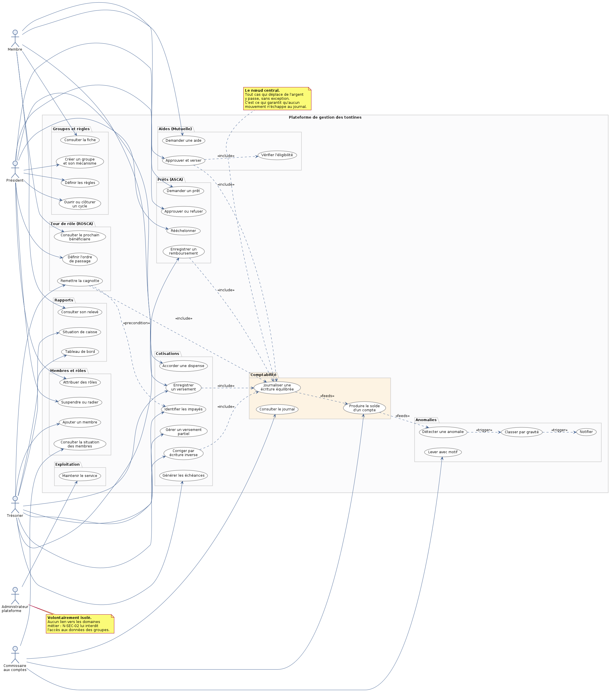
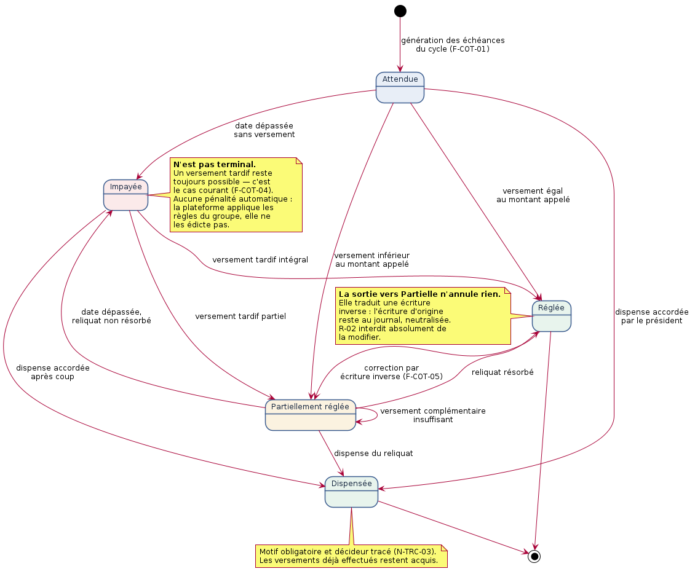
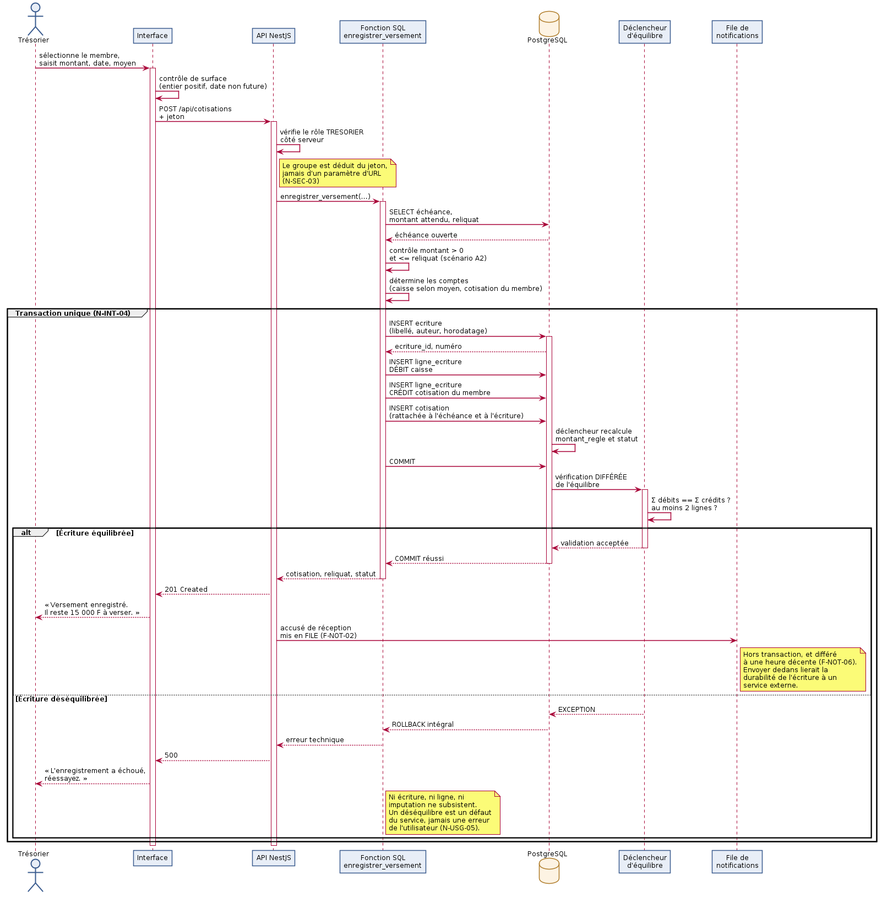
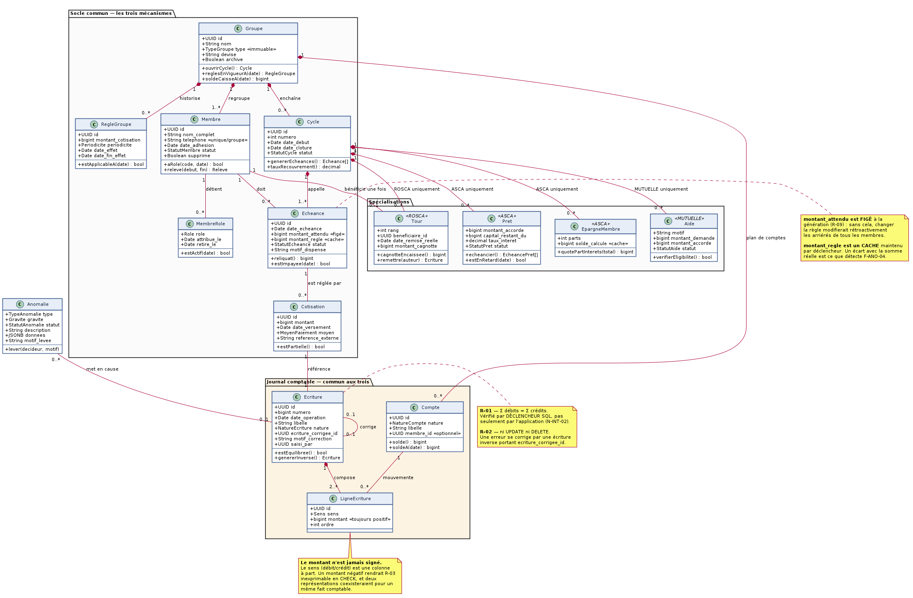

# Plateforme de gestion des tontines et associations

Registre transparent et vérifiable pour les tontines, associations, mutuelles et
caisses communautaires — avec **détection automatique des incohérences** avant
qu'elles ne deviennent des conflits.

**Essayer en trois commandes** → [Démarrage rapide](#démarrage-rapide) ·
**Comprendre** → [Comment ça marche](#comment-ça-marche) ·
**Éprouver** → [Guide de test](#guide-de-test)

---

## Table des matières

1. [Le problème](#le-problème)
2. [Démarrage rapide](#démarrage-rapide)
3. [Comment ça marche](#comment-ça-marche)
   — [Les trois mécanismes](#les-trois-mécanismes) ·
   [Le journal en partie double](#le-journal-en-partie-double) ·
   [Rôles et habilitations](#rôles-et-habilitations) ·
   [Cycle de vie d'une cotisation](#cycle-de-vie-dune-cotisation) ·
   [Détection d'anomalies](#détection-danomalies) ·
   [Notifications](#notifications)
4. [Guide de test](#guide-de-test)
   — [Parcours dans l'interface](#parcours-1--interface-trésorière-rosca) ·
   [Tests automatisés](#tests-automatisés) ·
   [Éprouver les invariants](#éprouver-les-invariants) ·
   [Tester en ligne de commande](#tester-lapi-en-ligne-de-commande)
5. [Architecture](#architecture)
6. [Référence des routes](#référence-des-routes)
7. [Arborescence](#arborescence)
8. [Dépannage](#dépannage)
9. [Ce qui n'est pas fait](#ce-qui-nest-pas-fait)
10. [Conventions et documentation](#conventions)

---

## Le problème

La gestion d'une tontine est presque toujours manuelle : cahier papier, tableau
Excel, ou mémoire du trésorier. Trois conséquences se retrouvent partout.

**L'opacité** — les membres ignorent l'état réel de la caisse et découvrent un
écart en assemblée, trop tard. **L'erreur non détectée** — une cotisation
oubliée ou un remboursement mal imputé ne se révèle qu'à l'arrêté des comptes,
quand la reconstitution coûte cher. **La dépendance au trésorier** — si le
cahier se perd, l'historique disparaît avec lui.

L'enjeu dépasse la comptabilité : un litige non résolu dissout le groupe. La
plateforme vise donc moins la performance de gestion que **la restitution d'une
confiance vérifiable**.

> **Projet indépendant.** Il ne partage ni code, ni base, ni dépendance avec les
> autres projets de cette machine. Sa base tourne dans son propre conteneur
> (port 55433), son API sur le port 3100.

---

## Démarrage rapide

**Prérequis** : Docker, Node.js 20 ou plus.

```bash
# 1. Base de données — conteneur, 15 migrations, 3 groupes de démonstration
./scripts/db.sh demarrer

# 2. API + interface
cd api
cp .env.example .env      # remplacez JWT_SECRET par une valeur aléatoire
npm install
npm run dev
```

Ouvrez **http://localhost:3100/** et connectez-vous :

| Téléphone | Mot de passe | Vous êtes |
|---|---|---|
| `+237690110002` | `tontine2026` | Marie Ebolo, **trésorière** d'une tontine de 12 femmes |

Vous arrivez sur l'écran de saisie — le geste quotidien d'une trésorière. Trois
membres n'ont pas encore versé pour le tour en cours.

> Pour un secret JWT solide : `openssl rand -base64 48`

---

## Comment ça marche

### Le principe en une phrase

**L'argent ne transite jamais par la plateforme.** Elle *enregistre* des
mouvements réalisés ailleurs — espèces, Mobile Money — sans jamais les
encaisser. Aucun agrément financier n'est requis, aucun avoir n'est détenu. Les
soldes affichés sont comptables, pas des portefeuilles.

C'est pourquoi le mot « payer » n'apparaît nulle part dans l'interface : on
*enregistre un versement*, on ne paie pas.

### Les trois mécanismes

Un groupe choisit son mécanisme à la création, et ce choix est **définitif** :
changer de mécanisme rendrait ininterprétables les écritures déjà passées.

| | ROSCA | ASCA | Mutuelle |
|---|---|---|---|
| **Principe** | Chacun cotise, un membre reçoit toute la cagnotte à chaque tour | Les cotisations s'accumulent, la caisse prête avec intérêts | Fonds collectif mobilisé lors d'événements |
| **Caisse** | vidée à chaque tour | croît puis est redistribuée | croît et se dépense |
| **Droit du membre** | recevoir la cagnotte une fois par cycle | solde d'épargne individuel | aucun droit individuel |
| **Spécificité** | ordre de passage arrêté à l'avance | prêts avec échéancier | aides non remboursables |

Leurs règles d'argent étant incompatibles, le schéma repose sur un **socle
commun** (groupes, membres, cotisations, journal comptable) complété de **tables
spécialisées** par mécanisme. Un `tour` n'existe que pour une ROSCA, un `pret`
que pour une ASCA, une `aide` que pour une mutuelle — et **la base refuse le
contraire**, ce n'est pas une convention de code.

### Le journal en partie double

Toute somme est portée au débit d'un compte et au crédit d'un autre. **Rien
n'est jamais modifié ni supprimé** : une erreur se corrige par une écriture
inverse qui référence l'écriture d'origine.

```
Cotisation de 25 000 F de Khadija Sow, réglée en espèces

  Écriture #37  « Cotisation du 05/09/2026 — Khadija Sow »
    ├─ DÉBIT   caisse_espèces               25 000
    └─ CRÉDIT  cotisations_membre_Khadija   25 000
                                            ──────
                               équilibre :       0  ✓
```

Ce choix paraît lourd ; il est en réalité ce qui rend la détection d'anomalies
rigoureuse. Un solde n'est pas une valeur que l'on maintient — donc que l'on peut
désynchroniser — mais une valeur que l'on **recalcule**. Un écart cesse d'être
une intuition : c'est un déséquilibre arithmétique, localisable à l'écriture près.

**L'utilisateur ne voit jamais un débit ni un crédit.** Il lit « vous avez versé
25 000 F le 5 septembre ».

### Rôles et habilitations

Quatre rôles, cumulables. Les habilitations sont vérifiées **côté serveur à
chaque appel**, depuis la base — pas depuis le jeton, qui pourrait être périmé.

| Rôle | Ce qu'il fait |
|---|---|
| **Membre** | Consulte sa situation, son relevé, le rapport d'assemblée. Demande un prêt ou une aide. |
| **Trésorier** | Enregistre les versements, remet la cagnotte, encaisse les remboursements, verse les aides. |
| **Président** | Approuve ou refuse prêts et aides, accorde les dispenses, rééchelonne, archive le groupe. |
| **Commissaire** | Consulte le journal, lève les anomalies — y compris les critiques, réservées à lui seul. |

**La séparation est tenue jusque dans les routes** : le président décide, le
trésorier verse. Une présidente qui tenterait de verser elle-même une aide
qu'elle vient d'approuver reçoit un refus.

Le cumul de rôles est autorisé — dans les petits groupes, une même personne
préside et tient la caisse — mais l'interface le signale quand il affaiblit le
contrôle mutuel.

#### Qui fait quoi — diagramme de cas d'utilisation



Les traits pleins portent l'initiative d'un acteur, les pointillés une
dépendance entre cas. **Le nœud central est « Journaliser une écriture
équilibrée »** : tout cas qui déplace de l'argent y passe, sans exception.

**L'administrateur plateforme est volontairement isolé** — aucun lien vers les
domaines métier, car N-SEC-02 lui interdit l'accès aux données des groupes.

### Cycle de vie d'une cotisation



**`IMPAYÉE` n'est pas terminal** : un versement tardif reste toujours possible,
et c'est le cas courant dans les groupes réels. **`RÉGLÉE` admet une sortie** :
une correction ramène l'échéance en `PARTIELLE`, sans jamais toucher à
l'écriture d'origine.

### Détection d'anomalies

L'apport différenciant. Six familles de signalements, exécutées en tâche de
fond — **jamais pendant une saisie** :

| Anomalie | Ce qui la déclenche | Gravité |
|---|---|---|
| Cotisation manquante | Échéance dépassée de 7 jours sans versement | relevée à **critique** si le membre a déjà reçu sa cagnotte |
| Remboursement en retard | Échéance de prêt non honorée | critique au-delà de 15 jours |
| Montant inhabituel | Versement s'écartant de 3 × l'écart médian du membre | information ou avertissement |
| Solde incohérent | Divergence entre une valeur suivie et le journal | **toujours critique** |
| Double saisie | Deux versements identiques à moins de 10 minutes | critique si même référence Mobile Money |
| Saisie tardive | Écriture enregistrée longtemps après l'opération | critique si datée du futur |

> **Une anomalie est un signalement, jamais une accusation.** L'écran s'appelle
> « À vérifier », jamais « Alertes ». Le message dit explicitement : *« Il ne
> s'agit pas d'une accusation : la plupart de ces écarts s'expliquent
> simplement. »* Une anomalie levée reste consignée avec son motif — la levée
> fait partie de la piste d'audit.

**Pourquoi la médiane et non la moyenne**, pour le montant inhabituel : une
moyenne est tirée par les valeurs extrêmes, et un seul versement exceptionnel
rendrait aveugle aux suivants. Minimum 6 versements d'historique — en deçà, un
nouveau membre serait signalé simplement parce qu'il est nouveau.

### Notifications

Rien n'est envoyé au moment de l'événement. Tout passe par une **file
d'attente**, pour trois raisons qui se cumulent :

- **Plage horaire décente** (7 h – 20 h) : un versement saisi à 23 h ne doit pas
  réveiller le membre. Une anomalie critique fait exception — elle porte sur de
  l'argent peut-être déjà disparu.
- **Ne jamais bloquer une saisie** : envoyer dans la transaction lierait la
  durabilité de l'écriture à la disponibilité d'un service externe.
- **Rejouer un échec** : report progressif 5 → 10 → 20 → 40 min, puis abandon
  consigné au cinquième essai. Savoir qu'un membre n'a **jamais** pu être
  prévenu est une information.

⚠️ **L'envoi réel n'est pas implémenté** — voir [Ce qui n'est pas
fait](#ce-qui-nest-pas-fait).

---

## Guide de test

Trois façons d'éprouver la plateforme, de la plus concrète à la plus exhaustive.

### Parcours 1 — Interface, trésorière ROSCA

**But** : encaisser les cotisations manquantes puis remettre la cagnotte.

```bash
./scripts/db.sh reinitialiser   # décor propre
cd api && npm run dev
```

Connectez-vous en **`+237690110002` / `tontine2026`** (Marie Ebolo, trésorière).

| # | Action | Ce que vous devez observer |
|---|---|---|
| 1 | Onglet **Situation** | Caisse à 210 000 F, tour 3 pour Fatou Bâ, il manque 90 000 F |
| 2 | Onglet **Impayés** | 3 membres en attente + Georgette Akono, *dispensée* avec son motif |
| 3 | Onglet **Tours** | Le bouton de remise est **absent**, avec la raison affichée |
| 4 | Onglet **Saisir** | Montant prérempli au reste dû, date à aujourd'hui |
| 5 | Saisissez un montant **supérieur** au reste dû | Refus : « le versement dépasse le reste dû » |
| 6 | Saisissez le montant exact, pour les 3 membres | « Versement enregistré. X est à jour. » |
| 7 | Retour sur **Tours** | Le bouton apparaît : « Remettre 275 000 F à Fatou Bâ » |
| 8 | Cliquez | 275 000 F et non 300 000 — la dispense est déduite |
| 9 | Onglet **Situation** | **Caisse à 0 F** : en ROSCA, elle se vide à chaque tour |

L'étape 3 est la plus instructive : le bouton n'est pas *grisé*, il est *absent*
— un bouton inactif invite à chercher comment le débloquer.

### Parcours 2 — Prêts ASCA

Connectez-vous en **`+237677220001` / `tontine2026`** (Émile Njoya, président).

| # | Action | Attendu |
|---|---|---|
| 1 | Onglet **Prêts** | 1 prêt en cours, 150 000 F restant dus ; avoir de la caisse affiché |
| 2 | Onglet **Situation** | Caisse à 1 862 000 F — **elle ne se vide pas**, contrairement à la ROSCA |
| 3 | Onglet **À vérifier** → *Relancer la vérification* | Un retard de remboursement est signalé |
| 4 | Cliquez **Justifier**, tapez « vu » | Refus : le motif doit faire au moins 20 caractères |
| 5 | Tapez un vrai motif | L'écart bascule dans « Déjà justifiées », avec votre nom |

Notez qu'il n'y a **pas d'onglet Tours** : une ASCA n'a pas d'ordre de passage.

### Parcours 3 — Aides mutualistes

Connectez-vous en **`+237699330001` / `tontine2026`** (Pauline Kamdem, présidente).

| # | Action | Attendu |
|---|---|---|
| 1 | Onglet **Aides** | 3 aides : une versée, une accordée à remettre, une à étudier |
| 2 | **Décider** sur la demande en attente | Vous pouvez accorder **moins** que demandé |
| 3 | Tentez de **Remettre** une aide accordée | Le bouton est absent : la présidente décide, le trésorier verse |
| 4 | Reconnectez-vous en `+237699330002` | Le bouton **Remettre** apparaît |

### Tests automatisés

**70 tests d'intégration**, contre la vraie base — jamais contre des doublures.
Les invariants vivant dans le schéma, une doublure testerait la moitié qui ne
peut pas casser.

```bash
./scripts/db.sh reinitialiser   # OBLIGATOIRE avant chaque passage
cd api && npm run tester
```

| Fichier | Tests | Ce qu'il éprouve |
|---|---|---|
| `authentification.spec.ts` | 9 | Routes protégées par défaut, jeton, cloisonnement |
| `metier.spec.ts` | 13 | Cotisations, impayés, tour de rôle, journal |
| `jalon2.spec.ts` | 18 | Prêts, aides, anomalies, cloisonnement entre 3 groupes |
| `jalon3.spec.ts` | 19 | Rapports, exports, Mobile Money, rééchelonnement |
| `notifications.spec.ts` | 11 | File, plage horaire, déduplication, alertes |

> **Les tests consomment le jeu de démonstration** : ils encaissent le tour 3,
> remettent la cagnotte, octroient des prêts. Sans `reinitialiser` préalable,
> les échéances sont déjà réglées et le parcours échoue — l'échec vient du décor,
> pas du code.

Autres commandes :

```bash
npm run verifier-types      # compilation TypeScript seule
npm run tester:surveille    # relance à chaque modification
```

### Éprouver les invariants

La commande la plus importante du projet. Elle ne *lit* pas le schéma : elle
**tente** des violations et exige un refus.

```bash
./scripts/db.sh verifier
```

```
  R-02 modification d'une écriture             refusé
  R-02 suppression d'une ligne                 refusé
  R-03 montant négatif                         refusé
  R-04 deux tours pour un même membre          refusé
  R-10 téléphone dupliqué                      refusé
  F-GRP-01 changement de type de groupe        refusé

  Équilibre global du journal : 0 — équilibré

  ✓ tous les invariants tiennent
```

**Un invariant jamais mis à l'épreuve n'est pas un invariant, c'est une
intention.**

### Recettes d'acceptation

Trois scénarios de bout en bout, un par jalon. Chacun **exécute** le métier par
les fonctions SQL, puis vérifie des propriétés à chaque étape.

```bash
./scripts/db.sh recette          # jalon 1 — cycle ROSCA complet, 12 tours
./scripts/db.sh recette-jalon2   # jalon 2 — prêts, aides, anomalies
./scripts/db.sh recette-jalon3   # jalon 3 — rapports, Mobile Money, archivage
```

La recette du jalon 1 vérifie **à chaque tour** que la caisse retombe à zéro et
que le journal reste équilibré. Un contrôle final ne distinguerait pas douze
tours corrects d'une compensation fortuite entre deux erreurs opposées.

```
  tour  3 —  275000 F remis à Fatou Bâ        (caisse: 0, journal: équilibré)
  tour  4 —  300000 F remis à Christine Manga (caisse: 0, journal: équilibré)
  ...
  12 tours remis, 12 bénéficiaires distincts (R-04)
  3575000 F encaissés = 3575000 F remis (conservation)
  ===== RECETTE RÉUSSIE — critère du jalon 1 satisfait =====
```

### Tester l'API en ligne de commande

```bash
# 1. Obtenir un jeton
JETON=$(curl -s -X POST http://localhost:3100/api/authentification/connexion \
  -H 'Content-Type: application/json' \
  -d '{"telephone":"+237690110002","mot_de_passe":"tontine2026"}' \
  | sed -n 's/.*"jeton":"\([^"]*\)".*/\1/p')

# 2. Tableau de bord
curl -s http://localhost:3100/api/tableau-de-bord \
  -H "Authorization: Bearer $JETON" | python3 -m json.tool

# 3. Impayés du cycle
curl -s http://localhost:3100/api/cotisations/impayes \
  -H "Authorization: Bearer $JETON" | python3 -m json.tool

# 4. Rapport d'assemblée
curl -s http://localhost:3100/api/rapport-assemblee \
  -H "Authorization: Bearer $JETON" | python3 -m json.tool

# 5. Export tableur
curl -s http://localhost:3100/api/exports/journal.csv \
  -H "Authorization: Bearer $JETON" -o journal.csv
```

**Vérifications de sécurité à tenter :**

```bash
# Sans jeton → 401
curl -s -o /dev/null -w '%{http_code}\n' http://localhost:3100/api/tableau-de-bord

# Rôle insuffisant → 403 (le commissaire ne saisit pas de versement)
# Ressource d'un autre groupe → 404, jamais 403 :
#   répondre « interdit » confirmerait son existence
```

### Explorer la base directement

```bash
./scripts/db.sh console
```

```sql
-- Le solde est TOUJOURS recalculé, jamais stocké
SELECT libelle, solde FROM v_solde_compte WHERE groupe_id =
  (SELECT id FROM groupe WHERE type = 'ROSCA');

-- Tentez de modifier une écriture : la base refuse (R-02)
UPDATE ecriture SET libelle = 'falsifié' WHERE numero = 1;

-- Le rapport d'assemblée, tel qu'il sera lu devant le groupe
SELECT rubrique, intitule, valeur
  FROM rapport_assemblee((SELECT id FROM groupe WHERE type = 'ASCA'));
```

---

## Architecture

```
┌──────────────────┐     HTTPS      ┌──────────────────┐
│  Web — 3 fichiers│ ─────────────► │   API (NestJS)   │
│  sans dépendance │ ◄───────────── │   TypeScript     │
└──────────────────┘   JSON, JWT    └────────┬─────────┘
                                             │ pg (SQL brut)
                                    ┌────────┴─────────┐
                                    │  PostgreSQL 16   │
                                    │  ─────────────   │
                                    │  contraintes,    │
                                    │  déclencheurs :  │
                                    │  les invariants  │
                                    │  financiers      │
                                    └──────────────────┘
```

**Pourquoi du SQL brut plutôt qu'un ORM.** Les invariants vivent dans le schéma :
équilibre des écritures garanti par déclencheur, unicité du bénéficiaire par
index unique, immuabilité par révocation de privilèges. Un ORM masquerait
précisément ce qui fait la sûreté du modèle.

**Où vit la logique métier.** Dans des fonctions PL/pgSQL, pas dans le service
TypeScript. Une fonction est **atomique par construction** : `enregistrer_versement`
insère l'écriture, ses lignes et la cotisation en une seule transaction.
Reconstituer ce séquencement en TypeScript exposerait à l'interrompre à
mi-chemin — et le déclencheur d'équilibre étant différé au `COMMIT`, une
écriture incomplète serait rejetée.

#### Le parcours d'un versement, de la saisie au journal



Le point central est la **vérification différée** : les lignes sont insérées
avant le contrôle d'équilibre, qui s'exécute à la validation de la transaction.
Un déséquilibre n'est pas corrigé — il est rejeté, et la transaction entière
annulée. Ni écriture, ni ligne, ni imputation ne subsistent.

#### La structure des données



**La spécialisation ne passe pas par l'héritage.** `Tour`, `Pret` et `Aide` ne
dérivent pas d'une superclasse commune : elles se rattachent au cycle sous une
contrainte de cohérence de type, vérifiée par la base. Un héritage objet
unifierait artificiellement trois mécanismes dont les règles d'argent sont
incompatibles.

**L'API se connecte en `tontine_app`**, rôle dont les privilèges `UPDATE` et
`DELETE` sont révoqués sur le journal. Elle le vérifie au démarrage :

```
[BaseService] Connecté en tant que « tontine_app »
[BaseService] R-02 vérifié : journal non modifiable par ce rôle
```

### Invariants tenus par la base

Chacun a été éprouvé par une tentative refusée, pas seulement déclaré :

| Règle | Ce que la base refuse | Mécanisme |
|---|---|---|
| R-01 | Écriture déséquilibrée, écriture à une seule ligne | `CONSTRAINT TRIGGER` différé |
| R-02 | `UPDATE` / `DELETE` sur le journal | Privilèges révoqués + déclencheur |
| R-03 | Montant négatif ou nul | `CHECK` |
| R-04 | Même bénéficiaire deux fois dans un cycle | Index unique |
| R-07 | Capital restant dû négatif ou supérieur au prêt | `CHECK` |
| R-09 | Règles de groupe aux périodes chevauchantes | Contrainte d'exclusion GiST |
| R-10 | Téléphone dupliqué dans un groupe | Index unique partiel |
| F-GRP-01 | Changement du type d'un groupe | Déclencheur |
| F-GRP-05 | Réouverture d'un cycle clôturé | Déclencheur |
| N-SEC-02 | Ressource rattachée à un membre d'un autre groupe | Déclencheur |
| Décision 0002 | Tour sur une ASCA, prêt sur une ROSCA, aide sur une ASCA | Déclencheur |

---

## Référence des routes

45 routes. **Aucune ne porte d'identifiant de groupe** : il vient du jeton
(N-SEC-03), ce qui rend une fuite transversale structurellement impossible
plutôt que simplement évitée.

<details>
<summary><b>Authentification et consultation</b></summary>

| Route | Rôle requis | Exigence |
|---|---|---|
| `POST /api/authentification/connexion` | — *(publique)* | N-SEC-01 |
| `GET /api/authentification/session` | authentifié | N-SEC-03 |
| `GET /api/tableau-de-bord` | authentifié | F-TDB-01, F-TDB-05 |
| `GET /api/membres` | authentifié | F-MBR-03 |
| `GET /api/situation-caisse` | bureau | F-RAP-02, F-TRX-04 |
| `GET /api/recouvrement` | bureau | F-RAP-03 |
| `GET /api/journal` | commissaire, bureau | F-TRX-03 |

</details>

<details>
<summary><b>Cotisations et tour de rôle</b></summary>

| Route | Rôle requis | Exigence |
|---|---|---|
| `GET /api/cotisations/impayes` | bureau | F-COT-04 |
| `POST /api/cotisations` | trésorier | F-COT-02, F-COT-03 |
| `POST /api/cotisations/:id/annulation` | trésorier | F-COT-05 |
| `POST /api/cotisations/echeances/:id/dispense` | président | F-COT-07 |
| `GET /api/cotisations/releve/:membre_id` | authentifié | F-RAP-01 |
| `GET /api/tours` | authentifié | F-TOU-02 |
| `POST /api/tours/:id/remise` | trésorier | F-TOU-03, R-05 |

</details>

<details>
<summary><b>Prêts ASCA</b></summary>

| Route | Rôle requis | Exigence |
|---|---|---|
| `GET /api/prets` | authentifié | F-RAP-04 |
| `GET /api/prets/avoir-disponible` | bureau | R-06 |
| `GET /api/prets/:id/echeancier` | authentifié | F-PRE-03 |
| `POST /api/prets` | authentifié | F-PRE-01 |
| `POST /api/prets/:id/approbation` | président | F-PRE-02, R-06 |
| `POST /api/prets/:id/refus` | président | F-PRE-02 |
| `POST /api/prets/:id/remboursement` | trésorier | F-PRE-04, R-07 |
| `POST /api/reechelonnements/:id` | président | F-PRE-07 |
| `GET /api/redistribution` | bureau | F-EPA-03, F-EPA-04 |

</details>

<details>
<summary><b>Aides mutualistes</b></summary>

| Route | Rôle requis | Exigence |
|---|---|---|
| `GET /api/aides` | authentifié | F-AID-01 |
| `GET /api/aides/:id/eligibilite` | bureau | F-AID-03 |
| `POST /api/aides` | authentifié | F-AID-01 |
| `POST /api/aides/:id/approbation` | président | F-AID-02 |
| `POST /api/aides/:id/versement` | trésorier | F-AID-02 |

</details>

<details>
<summary><b>Anomalies</b></summary>

| Route | Rôle requis | Exigence |
|---|---|---|
| `GET /api/anomalies` | commissaire, bureau | F-TDB-04 |
| `GET /api/anomalies/levees` | commissaire, bureau | F-ANO-08 |
| `POST /api/anomalies/balayage` | commissaire, bureau | F-ANO-01→06 |
| `POST /api/anomalies/:id/levee` | commissaire, trésorier | F-ANO-08, F-ANO-09 |

</details>

<details>
<summary><b>Rapports, exports et Mobile Money</b></summary>

| Route | Rôle requis | Exigence |
|---|---|---|
| `GET /api/rapport-assemblee` | authentifié | F-RAP-05 |
| `GET /api/exports/journal.csv` | bureau | F-RAP-06 |
| `GET /api/exports/membres.csv` | bureau | F-RAP-06 |
| `GET /api/exports/rapport.csv` | authentifié | F-RAP-06 |
| `GET /api/releves` | bureau | F-TRX-06 |
| `POST /api/releves` | trésorier | F-TRX-06 |
| `GET /api/releves/:id/rapprochement` | bureau | F-TRX-06 |
| `POST /api/archivage` | président | F-GRP-06 |

</details>

<details>
<summary><b>Notifications</b></summary>

| Route | Rôle requis | Exigence |
|---|---|---|
| `GET /api/notifications` | bureau | F-NOT |
| `GET /api/notifications/mes-notifications` | authentifié | F-NOT |
| `POST /api/notifications/balayage` | trésorier, président | F-NOT-01, F-COT-06 |
| `POST /api/notifications/accuse-versement` | trésorier | F-NOT-02 |
| `POST /api/notifications/expedition` | trésorier, président | F-NOT-04, F-NOT-05 |

</details>

**Le journal n'est pas exposé aux membres** : un membre lit son relevé en
langage courant, jamais le mécanisme comptable (N-USG-05). De même, les
anomalies sont réservées au bureau — donner à chacun la liste des écarts
constatés sur ses pairs transformerait un outil de contrôle mutuel en instrument
de surveillance réciproque.

---

## L'interface

Servie par l'API elle-même à **http://localhost:3100/**, en fichiers statiques.

| Écran | Contenu | Visible par |
|---|---|---|
| **Saisir** | Versement en deux gestes, montant prérempli au reste dû | trésorier |
| **Impayés** | Qui doit quoi, dispenses comprises | trésorier |
| **Situation** | Caisse, recouvrement, tour courant, ma situation | tous |
| **Membres** | Qui a versé combien, qui reste devoir | tous |
| **Tours** | Ordre de passage et remise de la cagnotte | ROSCA |
| **Prêts** | Encours, demandes à étudier, échéanciers | ASCA |
| **Aides** | Demandes, décisions, versements | Mutuelle |
| **Rapport** | Rapport d'assemblée et export tableur | tous |
| **À vérifier** | Anomalies ouvertes et déjà justifiées | bureau |
| **Mobile Money** | Rapprochement d'un relevé d'opérateur | trésorier |
| **Opérations** | Historique, annulations barrées mais visibles | bureau |

**Les onglets suivent le mécanisme du groupe.** « Tours » n'apparaît qu'en
ROSCA, « Prêts » qu'en ASCA, « Aides » qu'en mutuelle. Afficher un onglet
« Prêts » à une tontine rotative promettrait une fonction qui n'existe pas pour
elle — et que la base refuserait.

**Ni React, ni étape de construction, ni dépendance.** N-USG-02 impose moins de
100 ko par écran utile : un bundle React minimal dépasse 140 ko avant la
première ligne de code métier. Ici l'ensemble pèse **52 ko**, et le fichier
servi est le fichier écrit. Corollaire assumé : pas de composants, pas de JSX.
Au-delà d'une vingtaine d'écrans, l'arbitrage mériterait d'être revu.

Le vocabulaire est tenu sans exception (N-USG-05) : on *annule* un versement, on
ne passe pas d'écriture inverse ; on lit « il reste 15 000 F à verser », pas
« échéance partielle ».

---

## Comptes de démonstration

Mot de passe commun : **`tontine2026`**.

**Trois groupes coexistent sur la même base**, un par mécanisme. C'est la seule
configuration où le cloisonnement (N-SEC-02) et la cohérence de type sont
réellement mis à l'épreuve : tant qu'un seul groupe existe, aucune fuite
transversale n'est observable.

| Groupe | Téléphone | Membre | Rôle |
|---|---|---|---|
| **ROSCA** — Tontine des Femmes de Bonabéri<br>*12 membres, cycle au tour 3* | `+237690110001` | Awa Ndiaye | présidente |
| | `+237690110002` | Marie Ebolo | **trésorière** |
| | `+237690110003` | Fatou Bâ | commissaire |
| **ASCA** — Caisse d'épargne des Jeunes de Deido<br>*8 membres, 1 prêt en cours* | `+237677220001` | Émile Njoya | président |
| | `+237677220002` | Patrick Mbappé | trésorier |
| **MUTUELLE** — Association Solidarité de Bafoussam<br>*10 membres, 3 aides* | `+237699330001` | Pauline Kamdem | présidente |
| | `+237699330002` | Joseph Tagne | trésorier |

Les trois jeux ont des **dates relatives au jour de chargement** : un décor aux
dates figées vieillit et met en défaut les règles de détection qu'il sert à
illustrer.

---

## Arborescence

```
tontine-platform/
├── api/              API NestJS — 45 routes, 70 tests d'intégration
│   └── src/
│       ├── base/            Pool pg, transactions, vérification R-02
│       ├── authentification/ Jeton, gardes globales, session
│       ├── cotisations/     Versements, annulations, dispenses
│       ├── groupes/         Membres, tours, tableau de bord, journal
│       ├── prets/           Demandes, décisions, remboursements
│       ├── aides/           Demandes, décisions, versements
│       ├── anomalies/       Balayage, levées
│       ├── rapports/        Assemblée, exports, Mobile Money
│       └── notifications/   File, expéditeur enfichable
├── db/
│   ├── migrations/   15 fichiers, numérotés, idempotents
│   │   ├── 001–003   Socle, journal en partie double, cycle ROSCA
│   │   ├── 004       Utilisateurs et journal d'accès
│   │   ├── 005–007   Cotisations, tour de rôle, restitution
│   │   ├── 008–009   Épargne et prêts ASCA, aides mutualistes
│   │   ├── 010–011   Moteur d'anomalies, métier des prêts et aides
│   │   ├── 012–014   Fin de cycle, Mobile Money, rapports et exports
│   │   └── 015       Notifications : file, plage horaire, rappels
│   ├── seeds/        4 fichiers — un groupe par mécanisme, dates relatives
│   └── recette/      3 scénarios d'acceptation, un par jalon
├── web/              Interface — 3 fichiers, 52 ko, aucune dépendance
│   ├── index.html    Structure des écrans
│   ├── style.css     Téléphone d'abord, polices système
│   └── app.js        Session, appels API, rendu des 11 écrans
├── docs/
│   ├── cahier-des-charges.md     Exigences codées (F-COT-02, R-01…)
│   ├── conception-interface.md   Écrans, enchaînement, vocabulaire
│   ├── modele-de-donnees.md      MCD, dictionnaire, invariants
│   ├── detection-anomalies.md    Règles et seuils
│   ├── diagrammes/               Cas d'utilisation, classes, séquences, états
│   └── decisions/                Décisions d'architecture argumentées
└── scripts/
    ├── db.sh         Pilotage de la base de développement
    └── dossier-pdf.py Assemble la documentation en un PDF
```

### Commandes disponibles

```
./scripts/db.sh demarrer        Conteneur, migrations, jeux de données
./scripts/db.sh arreter         Arrête en conservant les données
./scripts/db.sh reinitialiser   Vide le schéma et réapplique tout
./scripts/db.sh verifier        Éprouve les invariants : tente des violations
./scripts/db.sh recette         Jalon 1 — cycle ROSCA complet
./scripts/db.sh recette-jalon2  Jalon 2 — prêts, aides, anomalies
./scripts/db.sh recette-jalon3  Jalon 3 — rapports, Mobile Money
./scripts/db.sh console         Console psql
./scripts/db.sh tester          Vérifie la connexion
./scripts/db.sh supprimer       Supprime le conteneur (confirmation demandée)
```

---

## Dépannage

> **« Site inaccessible » dans le navigateur ?** C'est presque toujours la base
> qui s'est arrêtée : l'API ne peut pas s'y connecter, et s'interrompt au
> démarrage sans jamais écouter le port. Vérifiez d'abord le conteneur —
> `docker ps -a --filter name=tontine-db` — puis relancez dans l'ordre :
>
> ```bash
> ./scripts/db.sh demarrer     # d'abord la base
> cd api && npm run dev        # ensuite l'API
> ```
>
> L'API annonce trois lignes quand tout va bien. Si elles n'apparaissent pas,
> le problème est en amont :
>
> ```
> [BaseService] Connecté en tant que « tontine_app »
> [BaseService] R-02 vérifié : journal non modifiable par ce rôle
> [Démarrage]   API à l'écoute sur http://localhost:3100/api
> ```

| Symptôme | Cause probable | Remède |
|---|---|---|
| **Site inaccessible** | Conteneur arrêté — l'API n'a pas pu joindre la base | `./scripts/db.sh demarrer` puis relancer l'API |
| `EADDRINUSE :::3100` | Une instance tourne déjà | `pkill -f "api/node_modules/.bin/nest"` |
| `ECONNREFUSED …:55433` | Base arrêtée | `./scripts/db.sh demarrer` |
| `npm run dev` tourne mais rien ne répond | Démarré avant la base : `--watch` maintient le processus sans serveur | Arrêter, démarrer la base, relancer |
| Tests en échec au 2ᵉ passage | Le décor a été consommé | `./scripts/db.sh reinitialiser` |
| `JWT_SECRET is not defined` | `.env` absent | `cp .env.example .env` dans `api/` |
| `permission denied for table…` | Migrations partiellement appliquées | `./scripts/db.sh reinitialiser` |
| La page ne charge pas | API non démarrée | `cd api && npm run dev` |
| `connection refused` port 55433 | Conteneur arrêté | `./scripts/db.sh demarrer` |
| Aucune anomalie détectée | Le décor est sain — c'est normal | Onglet **À vérifier** → *Relancer la vérification* |

**Repartir totalement de zéro :**

```bash
./scripts/db.sh supprimer && ./scripts/db.sh demarrer
```

---

## Ce qui n'est pas fait

Trois limites, énoncées plutôt que masquées.

**L'envoi réel des notifications.** La file d'attente, la plage horaire décente,
la déduplication, le report progressif et l'abandon après cinq échecs sont
implémentés et éprouvés. L'envoi ne l'est pas : aucun service SMTP ni passerelle
WhatsApp n'était joignable depuis l'environnement de développement, et livrer un
code d'envoi non testé aurait donné l'illusion que les membres sont prévenus
alors que personne n'aurait pu dire si un message était parti.

L'expéditeur est enfichable : `ExpediteurJournal` consigne et annonce `aucun
envoi réel` jusque dans sa réponse HTTP. Brancher une vraie passerelle ne touche
qu'un fichier — `notifications.module.ts`.

**Les diagrammes en images dans le PDF.** `scripts/dossier-pdf.py` assemble la
documentation en un PDF de 48 pages. Les 11 diagrammes y figurent en source
Mermaid, faute d'avoir pu installer `@mermaid-js/mermaid-cli` (réseau
intermittent). Le script les rendra en images dès que l'outil sera disponible,
sans modification.

**L'usage réel.** La plateforme n'a jamais tourné avec un vrai groupe. Les jeux
de démonstration sont construits pour éprouver les règles, pas pour refléter la
diversité des pratiques — enchères pour l'ordre de passage, cotisations
saisonnières, groupes de plus de cinquante membres.

---

## Conventions

- **Français intégral** — le vocabulaire métier est nativement français
  (cotisation, tour, bénéficiaire, cagnotte). Traduire introduirait une
  correspondance permanente entre le langage des utilisateurs et celui du code.
- **Montants en `BIGINT`**, en francs — jamais de flottant sur de l'argent :
  `0.1 + 0.2 ≠ 0.3` en binaire, et une caisse ne tolère pas l'arrondi silencieux.
- **UUID** partout — pas de fuite d'information par incrément.
- **Tables au singulier**, `snake_case` ; vues préfixées `v_`.
- **Les commentaires expliquent le *pourquoi***, jamais le *quoi*, et
  référencent les exigences par code (`F-COT-02`, `R-01`).
- **Routes protégées par défaut** : oublier d'ouvrir rend une route
  inaccessible — visible aussitôt ; oublier de protéger exposerait des données
  en silence.
- **Migrations idempotentes** — ré-exécutables sans effet de bord. Il n'existe
  pas de table de suivi : l'ordre et l'idempotence en tiennent lieu.

---

## Documentation

| Document | Objet |
|---|---|
| [Cahier des charges](docs/cahier-des-charges.md) | Acteurs, exigences codées, règles de gestion, jalons |
| [Conception de l'interface](docs/conception-interface.md) | Écrans, enchaînement, vocabulaire employé |
| [Modèle de données](docs/modele-de-donnees.md) | Schéma, dictionnaire, invariants |
| [Détection d'anomalies](docs/detection-anomalies.md) | Règles, seuils, gravités |
| [Diagrammes UML](docs/uml/images/) | **Images PNG** — cas d'utilisation, séquences, états, classes |
| [Sources des diagrammes](docs/uml/) | Fichiers PlantUML, régénérables hors ligne |
| [Diagrammes (Markdown)](docs/diagrammes/) | Mêmes diagrammes commentés, en Mermaid |
| [Décisions](docs/decisions/) | Arbitrages d'architecture et alternatives écartées |

### Diagrammes UML

Onze diagrammes en **notation UML standard**, rendus en PNG :

| Diagramme | Type UML | Ce qu'il montre |
|---|---|---|
| `cas-utilisation.png` | Cas d'utilisation | Qui fait quoi — acteurs, cas, relations `<<include>>` |
| `sequence-cotisation.png` | Séquence | Enregistrer un versement, de la saisie au journal |
| `sequence-cagnotte.png` | Séquence | Remise de la cagnotte, avec les deux refus possibles |
| `sequence-anomalie.png` | Séquence | Détection en tâche de fond, puis notification |
| `etats-cycle.png` | États-transitions | Cycle de vie d'un cycle |
| `etats-echeance.png` | États-transitions | Cycle de vie d'une échéance |
| `etats-pret.png` | États-transitions | Cycle de vie d'un prêt |
| `etats-anomalie.png` | États-transitions | Détection, vérification, levée |
| `classes.png` | Classes | Socle commun et trois spécialisations |
| `classes-journal.png` | Classes | Le cœur comptable — écriture, ligne, compte |
| `enumerations.png` | Classes | Les onze énumérations du domaine |

```bash
./scripts/generer-uml.sh        # régénère les 11 PNG depuis docs/uml/*.puml
```

**PlantUML plutôt que Mermaid.** Mermaid ne dispose pas de diagramme de cas
d'utilisation — il fallait le simuler par un graphe orienté, perdant la
notation UML. PlantUML produit la notation standard et rend **hors ligne**,
sans dépendance réseau.

**Dossier complet en PDF** : `python3 scripts/dossier-pdf.py` assemble les onze
documents en un seul fichier de 49 pages — page de garde, sommaire, et les
**onze diagrammes en images**, plus aucune source illisible.

---

## État du projet

| Domaine | État |
|---|---|
| Conception | ✅ Cahier des charges, modèle, diagrammes, 3 décisions |
| Schéma | ✅ 23 tables, 255 fonctions, 12 vues, 15 migrations idempotentes |
| Métier ROSCA | ✅ Cotisations, tour de rôle, corrections, dispenses |
| Métier ASCA | ✅ Épargne, prêts, échéanciers, rééchelonnement, redistribution |
| Métier Mutuelle | ✅ Aides, éligibilité consultative, versements |
| Anomalies | ✅ 6 règles, gravités, levées motivées |
| Rapports | ✅ Assemblée, exports CSV, rapprochement Mobile Money |
| Notifications | ⚠️ File et règles éprouvées — **envoi réel non implémenté** |
| API | ✅ 45 routes, 70 tests d'intégration |
| Interface | ✅ 11 écrans, 52 ko, sans dépendance |

**Critère d'acceptation du jalon 1**, vérifié par `./scripts/db.sh recette` :
une tontine de 12 membres mène un cycle complet, la caisse reste équilibrée à
chaque tour, et tout écart est traçable.
