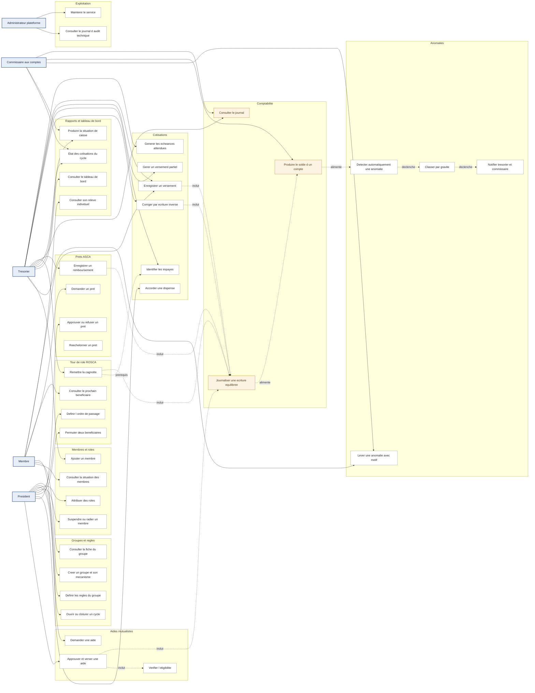

# Diagramme de cas d'utilisation

Ce document présente les interactions entre les acteurs et la plateforme, regroupées par domaine
fonctionnel. Il répond à la question « qui fait quoi », et rattache chaque cas à un code d'exigence
du [cahier des charges](../cahier-des-charges.md).

**Ce que ce diagramme ne montre pas** : ni l'ordre des opérations (voir [`sequences.md`](sequences.md)),
ni la structure des données (voir [`classes.md`](classes.md)), ni les cycles de vie
(voir [`etats.md`](etats.md)). Il ne montre pas non plus les mouvements d'argent eux-mêmes : la
plateforme est un registre, les versements se font hors application, en espèces ou par Mobile Money.

> Mermaid ne dispose pas d'un type de diagramme de cas d'utilisation. La représentation ci-dessous
> utilise un `graph LR` : acteurs à gauche, cas d'utilisation regroupés en sous-graphes par domaine.

---

## 1. Vue d'ensemble

**Lecture du diagramme.** Les traits pleins portent l'initiative d'un acteur. Les traits pointillés
portent une dépendance entre cas : `inclut` signale un cas systématiquement invoqué par un autre,
`déclenche` un enchaînement automatique sans acteur humain. Le nœud central est
« Journaliser une écriture équilibrée » : tout cas qui déplace de l'argent y passe, sans exception.
C'est ce qui garantit qu'aucun mouvement n'échappe au journal (F-TRX-01, R-01).

**L'administrateur plateforme est volontairement isolé.** Il n'a aucun lien vers les domaines
métier : N-SEC-02 lui interdit l'accès aux données des groupes. Son périmètre s'arrête à
l'exploitation technique.

---

## 2. Cas d'utilisation principaux

| Cas | Acteur principal | Code exigence | Description |
|---|---|---|---|
| Créer un groupe et son mécanisme | Président | F-GRP-01 | Crée un groupe en choisissant ROSCA, ASCA ou MUTUELLE. Le choix est structurant : il conditionne les tables spécialisées disponibles et n'est pas modifiable ensuite. |
| Définir les règles du groupe | Président | F-GRP-02, F-GRP-04, R-09 | Fixe montant, périodicité, devise et date de début. Une modification ultérieure est datée et ne s'applique qu'aux échéances futures. |
| Ouvrir ou clôturer un cycle | Président | F-GRP-05 | Ouvre la période au terme de laquelle, en ROSCA, tous les membres auront bénéficié d'un tour. |
| Ajouter un membre | Trésorier | F-MBR-01, R-10 | Enregistre nom, téléphone et date d'adhésion. Le téléphone est l'identifiant naturel, unique au sein du groupe. |
| Attribuer des rôles | Président | F-MBR-02, F-MBR-06 | Attribue un ou plusieurs rôles. L'interface avertit lorsque le cumul trésorier / commissaire affaiblit le contrôle mutuel. |
| Suspendre ou radier un membre | Président | F-MBR-04, R-08 | Suppression logique : l'historique comptable du membre est conservé intégralement. |
| Générer les échéances attendues | Trésorier | F-COT-01 | Produit les échéances du cycle selon la périodicité et le montant en vigueur à la date d'appel. |
| Enregistrer un versement | Trésorier | F-COT-02, F-TRX-01, N-USG-04 | Saisit un versement reçu hors application et crée l'écriture équilibrée correspondante, en moins de 30 secondes. |
| Gérer un versement partiel | Trésorier | F-COT-03 | Impute un montant inférieur à l'attendu et calcule le reliquat restant dû. |
| Identifier les impayés | Trésorier | F-COT-04 | Liste les échéances dont le cumul encaissé reste inférieur au montant appelé. |
| Corriger par écriture inverse | Trésorier | F-COT-05, F-TRX-02, N-TRC-02 | Annule une saisie erronée par une écriture inverse référençant l'écriture d'origine. Aucune suppression n'est possible. |
| Accorder une dispense | Président | F-COT-07 | Consigne la décision du groupe d'exonérer un membre d'une échéance, avec motif. |
| Définir l'ordre de passage | Président | F-TOU-01, R-04 | Fixe le rang de chaque bénéficiaire du cycle ROSCA. Un membre ne peut occuper qu'un seul rang. |
| Consulter le prochain bénéficiaire | Membre | F-TOU-02, F-TDB-05 | Affiche le tour courant et le bénéficiaire suivant. |
| Remettre la cagnotte | Trésorier | F-TOU-03, R-05 | Clôture le tour, calcule la cagnotte et enregistre sa remise au bénéficiaire par écriture équilibrée. |
| Permuter deux bénéficiaires | Président | F-TOU-04, N-TRC-03 | Échange deux rangs, avec motif tracé et décideur identifié. |
| Demander un prêt | Membre | F-PRE-01 | Soumet une demande de prêt sur l'avoir de la caisse ASCA. |
| Approuver ou refuser un prêt | Président | F-PRE-02, R-06 | Statue sur la demande. Le montant ne peut excéder l'avoir disponible de la caisse. |
| Enregistrer un remboursement | Trésorier | F-PRE-04, R-07 | Impute un remboursement et met à jour le capital restant dû, qui décroît jusqu'à zéro sans jamais passer en deçà. |
| Rééchelonner un prêt | Président | F-PRE-07, N-TRC-03 | Modifie l'échéancier d'un prêt en difficulté, avec motif. |
| Demander une aide | Membre | F-AID-01 | Soumet une demande motivée sur le fonds mutualiste. |
| Approuver et verser une aide | Président | F-AID-02, F-AID-03 | Statue puis enregistre le versement. L'éligibilité est vérifiée au préalable. |
| Journaliser une écriture équilibrée | Système | F-TRX-01, F-TRX-05, R-01 | Crée une écriture d'au moins deux lignes dont la somme des débits égale la somme des crédits. Rejetée par la base sinon. |
| Consulter le journal | Commissaire aux comptes | F-TRX-03 | Parcourt les écritures, filtrées et datées, corrections comprises. |
| Produire le solde d'un compte | Commissaire aux comptes | F-TRX-04, N-PRF-02 | Recalcule un solde à une date donnée par sommation du journal, sans lire de valeur stockée. |
| Détecter une anomalie | Système | F-ANO-01 à F-ANO-06, N-PRF-03 | Tâche de fond qui compare les invariants métier au journal et crée un signalement lorsqu'un écart apparaît. |
| Classer par gravité | Système | F-ANO-07 | Attribue un niveau de gravité conditionnant le circuit de notification. |
| Lever une anomalie | Commissaire aux comptes | F-ANO-08, N-TRC-03 | Justifie et clôt un signalement. La levée reste consignée avec son motif : elle fait partie de la piste d'audit. |
| Notifier trésorier et commissaire | Système | F-NOT-03, F-ANO-09, F-NOT-06 | Alerte les responsables, en respectant une plage horaire décente. |
| Consulter son relevé individuel | Membre | F-RAP-01, N-USG-05 | Lit ses versements en langage courant, sans vocabulaire comptable. |
| Produire la situation de caisse | Trésorier | F-RAP-02, F-TDB-01 | Établit l'état de la caisse à une date, reconstruit depuis le journal. |
| État des cotisations du cycle | Trésorier | F-RAP-03, F-TDB-02 | Présente le taux de recouvrement et les échéances restant dues. |
| Consulter le tableau de bord | Trésorier | F-TDB-01 à F-TDB-05 | Vue synthétique : solde, recouvrement, encours de prêts, anomalies ouvertes, prochaine échéance. |

---

## 3. Description détaillée — Enregistrer un versement de cotisation

| Rubrique | Valeur |
|---|---|
| **Code** | F-COT-02 |
| **Acteur principal** | Trésorier |
| **Acteurs secondaires** | Membre cotisant (destinataire de l'accusé de réception) |
| **Exigences liées** | F-COT-02, F-COT-03, F-TRX-01, F-TRX-05, R-01, R-03, N-INT-02, N-TRC-01, N-USG-04 |
| **Préconditions** | Le trésorier est authentifié ; le groupe est déduit de son jeton (N-SEC-03). Un cycle est ouvert. L'échéance visée existe et n'est ni réglée ni dispensée. Le versement a déjà été reçu physiquement, hors application. |
| **Postconditions** | Une écriture équilibrée et immuable est ajoutée au journal. L'échéance passe à `réglée` ou `partiellement_réglée`. Le solde de caisse recalculé intègre le versement. |
| **Déclencheur** | Le trésorier reçoit un versement en espèces ou une confirmation Mobile Money. |

### Scénario nominal

1. Le trésorier sélectionne le membre cotisant dans la liste du cycle courant.
2. Le système affiche l'échéance ouverte la plus ancienne, le montant appelé et le reliquat éventuel.
3. Le trésorier saisit le montant versé, la date de versement et le moyen de paiement.
4. Le système contrôle que le montant est un entier strictement positif (R-03, N-INT-03).
5. Le système contrôle que la date de versement n'est pas postérieure à la date du jour.
6. Le système construit l'écriture comptable : débit du compte de caisse correspondant au moyen de paiement, crédit du compte de cotisations du membre, pour un montant identique.
7. Le système ouvre une transaction, insère l'écriture puis ses deux lignes, et valide.
8. Le déclencheur SQL vérifie à la validation que la somme des débits égale la somme des crédits (R-01, N-INT-02). L'écriture est acceptée.
9. Le système impute le versement à l'échéance et recalcule le reliquat.
10. Le système fait passer l'échéance à `réglée` si le reliquat est nul, à `partiellement_réglée` sinon (F-COT-03).
11. Le système horodate l'écriture et y consigne l'identifiant du trésorier auteur (N-TRC-01).
12. Le système affiche la confirmation et le nouveau solde du membre en langage courant (N-USG-05).
13. Le système émet un accusé de réception au membre cotisant (F-NOT-02).

### Scénarios alternatifs

**A1 — Versement partiel** *(après l'étape 9)*
Le montant versé est inférieur au montant appelé. Le système enregistre l'écriture pour le montant
réellement reçu, calcule le reliquat et place l'échéance en `partiellement_réglée`. L'interface
affiche explicitement le reste dû. Le scénario nominal reprend à l'étape 11.

**A2 — Versement excédentaire** *(après l'étape 4)*
Le montant versé dépasse le reliquat de l'échéance. Le système propose d'imputer l'excédent à
l'échéance suivante du même cycle. Si le trésorier accepte, deux imputations sont produites au sein
d'une même transaction (N-INT-04) ; l'écriture comptable reste unique et équilibrée. Si le trésorier
refuse, l'excédent est porté au crédit d'un compte d'avance du membre.

**A3 — Correction d'une saisie erronée** *(à tout moment après validation)*
Le trésorier ne peut ni modifier ni supprimer l'écriture (F-TRX-02, R-02). Il déclenche l'action
« annuler et ressaisir » : le système génère une écriture inverse portant `ecriture_corrigee_id`
(N-TRC-02), puis rouvre le formulaire de saisie. Les deux écritures restent visibles au journal.

**A4 — Aucun cycle ouvert** *(à l'étape 1)*
Le système refuse la saisie et invite le président à ouvrir un cycle (F-GRP-05). Aucune écriture
n'est produite.

**A5 — Échéance déjà dispensée** *(à l'étape 2)*
Le système signale la dispense en vigueur et son motif (F-COT-07). Le trésorier peut néanmoins
enregistrer un versement volontaire ; l'anomalie de « montant inhabituel » (F-ANO-03) ne sera pas
levée automatiquement dans ce cas.

### Exceptions

**E1 — Écriture déséquilibrée** *(à l'étape 8)*
Le déclencheur SQL rejette l'écriture. La transaction est annulée dans son intégralité (N-INT-04) :
ni écriture, ni ligne, ni imputation ne subsistent. L'incident est consigné comme erreur technique ;
il traduit un défaut du service, jamais une erreur de l'utilisateur.

**E2 — Double saisie probable** *(après l'étape 8)*
La tâche de détection identifie ultérieurement deux versements identiques du même membre, au même
montant, à quelques minutes d'intervalle. Une anomalie F-ANO-05 est créée. Elle ne bloque pas la
saisie (N-PRF-03) : elle est signalée, puis vérifiée par un humain.

---

## 4. Description détaillée — Lever une anomalie

| Rubrique | Valeur |
|---|---|
| **Code** | F-ANO-08 |
| **Acteur principal** | Commissaire aux comptes |
| **Acteurs secondaires** | Trésorier (auteur de l'écriture mise en cause), Président (arbitre en cas de désaccord) |
| **Exigences liées** | F-ANO-07, F-ANO-08, F-ANO-09, F-NOT-03, N-TRC-03, N-SEC-05 |
| **Préconditions** | Une anomalie existe à l'état `détectée` ou `en vérification`. L'acteur détient le rôle de commissaire aux comptes ou de trésorier, vérifié côté serveur à chaque appel (N-SEC-05). |
| **Postconditions** | L'anomalie est à l'état `levée`, assortie d'un motif, d'un décideur et d'un horodatage. Elle reste consultable : la levée ne l'efface pas. |
| **Déclencheur** | Notification d'anomalie, ou consultation du tableau de bord (F-TDB-04). |

### Scénario nominal

1. Le commissaire aux comptes ouvre la liste des anomalies ouvertes, triées par gravité (F-ANO-07).
2. Il sélectionne une anomalie et consulte son détail : type, gravité, date de détection, écritures et échéances concernées.
3. Le système fait passer l'anomalie à `en vérification` et consigne l'identité du vérificateur.
4. Le commissaire consulte le journal des écritures mises en cause (F-TRX-03) et le relevé du membre concerné (F-RAP-01).
5. Il constate que l'écart s'explique : un versement effectué en fin de mois a été saisi le mois suivant, sans erreur de montant.
6. Il choisit l'action « lever l'anomalie » et rédige un motif obligatoire.
7. Le système contrôle que le motif est renseigné et suffisamment explicite ; un motif vide est refusé (N-TRC-03).
8. Le système fait passer l'anomalie à `levée`, en y attachant motif, décideur et horodatage.
9. L'anomalie reste consignée dans l'historique et demeure consultable : elle disparaît du tableau de bord des anomalies ouvertes, jamais de la piste d'audit.
10. Le système notifie le trésorier de la levée et de son motif (F-NOT-03).

### Scénarios alternatifs

**A1 — Anomalie confirmée au lieu d'être levée** *(à l'étape 5)*
La vérification établit un écart réel. Le commissaire choisit « confirmer » et décrit le constat.
L'anomalie passe à `confirmée`. Le système propose au trésorier l'action corrective adaptée :
écriture inverse (F-COT-05) ou saisie manquante. Aucune correction n'est appliquée automatiquement :
la plateforme signale, elle ne tranche pas.

**A2 — Levée par le trésorier, sur une anomalie de gravité faible**
Le trésorier peut lever lui-même une anomalie de gravité faible ou moyenne. Les anomalies graves
restent réservées au commissaire aux comptes (F-ANO-09), afin qu'un écart sérieux ne soit jamais
levé par la personne dont la saisie est en cause.

**A3 — Anomalie devenue sans objet** *(à tout moment)*
Un versement ultérieur a résorbé l'écart. La tâche de fond détecte que la condition de détection
n'est plus vérifiée et propose la levée automatique, assortie du motif « écart résorbé le
*jj/mm/aaaa* ». Le passage à `levée` reste soumis à confirmation humaine : c'est l'esprit de
F-ANO-08, où la justification appartient toujours à une personne.

**A4 — Désaccord entre trésorier et commissaire** *(à l'étape 6)*
Le commissaire refuse la justification proposée par le trésorier. L'anomalie reste `en vérification`
et le président est notifié pour arbitrage. La plateforme n'est pas une autorité d'arbitrage : elle
porte la trace du désaccord, la décision reste humaine.

**A5 — Cumul de rôles** *(à l'étape 1)*
Le vérificateur cumule les rôles de trésorier et de commissaire aux comptes. Le système affiche un
avertissement explicite (F-MBR-06) : la levée est possible mais consignée comme effectuée en
autocontrôle, information reportée au rapport d'assemblée.

### Exceptions

**E1 — Anomalie déjà levée** *(à l'étape 2)*
L'anomalie a été traitée entre-temps par un autre acteur. Le système affiche l'état courant, le motif
et le décideur. Aucune seconde levée n'est enregistrée : un état terminal n'est pas réinscriptible.

**E2 — Habilitation insuffisante** *(à l'étape 6)*
L'acteur ne détient pas le rôle requis pour la gravité concernée. Le serveur refuse l'action
(N-SEC-05) et consigne la tentative au journal d'audit des accès (N-SEC-06).

---

## Points de vigilance

- **Le verbe « lever » n'est pas « effacer ».** Une anomalie levée sort du tableau de bord mais reste
  au dossier avec son motif. Toute implémentation qui la supprime détruit la piste d'audit et vide
  F-ANO-08 de son sens.
- **Le cumul des rôles est autorisé mais jamais silencieux.** Le modèle `membre_role` le permet, car
  les petits groupes n'ont pas le choix. L'interface doit néanmoins signaler le cumul
  trésorier / commissaire, dont la séparation constitue la garantie du contrôle mutuel (F-MBR-06).
- **Aucun cas d'utilisation ne déplace d'argent.** Ils enregistrent des mouvements réalisés ailleurs.
  Un libellé d'interface comme « payer » ou « virer » induirait les membres en erreur sur la nature
  du service et laisserait croire que la plateforme détient des fonds.
- **L'administrateur plateforme n'a aucun cas métier.** Le diagramme le montre isolé, et ce n'est pas
  un oubli : N-SEC-02 lui interdit l'accès aux données des groupes. Toute fonction d'exploitation
  qui exigerait de lire une écriture doit être reconçue.
- **La détection d'anomalies n'a pas d'acteur humain déclencheur.** Elle s'exécute en tâche de fond
  (N-PRF-03) et ne doit jamais bloquer une saisie. Un moteur d'anomalies synchrone ferait échouer
  N-USG-04, qui impose une saisie en moins de 30 secondes.
- **Le prochain bénéficiaire est un cas de consultation, pas de décision.** L'ordre de passage est
  arrêté à l'avance (F-TOU-01). Un système qui « choisirait » le bénéficiaire s'arrogerait une
  décision appartenant au groupe.
