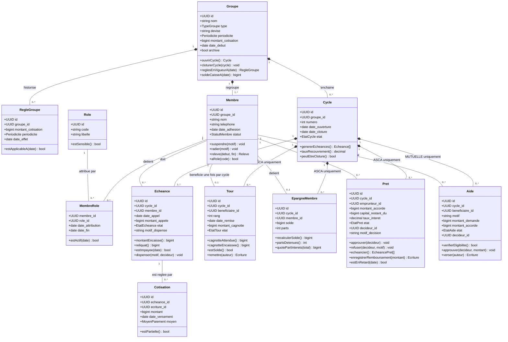
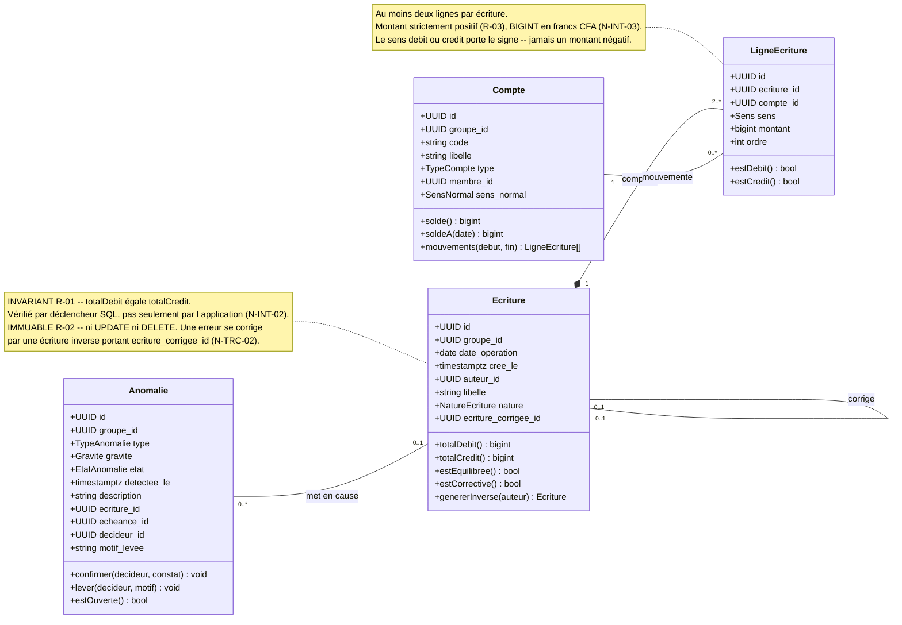
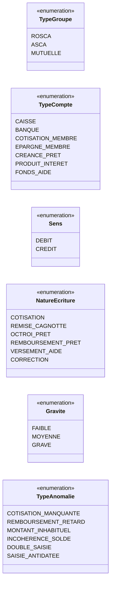

# Diagramme de classes

Ce document présente la structure statique du domaine : le socle commun partagé par les trois
mécanismes, les trois spécialisations, et le cœur comptable en partie double. Il traduit en objets
les décisions [`0002`](../decisions/0002-socle-commun-tables-specialisees.md) et
[`0003`](../decisions/0003-journal-partie-double.md), et se lit en parallèle du
[cahier des charges](../cahier-des-charges.md).

**Ce que ce diagramme ne montre pas** : ni la chronologie des opérations
(voir [`sequences.md`](sequences.md)), ni les cycles de vie (voir [`etats.md`](etats.md)), ni les
tables techniques d'authentification, de notification et d'audit d'accès. Les classes sont nommées
d'après les tables, en `snake_case` singulier côté SQL et en `PascalCase` côté modèle objet.

---

## 1. Socle commun et spécialisations

**La spécialisation ne passe pas par l'héritage de classes.** `Tour`, `EpargneMembre` et `Aide` ne
dérivent pas d'une superclasse commune : elles se rattachent au `Cycle` sous une contrainte de
cohérence de type. Une ligne de `tour` ne peut référencer qu'un cycle d'un groupe `ROSCA`, vérifié
par la base. Un héritage objet unifierait artificiellement trois mécanismes dont les règles d'argent
sont incompatibles, et déplacerait les invariants du schéma vers du code — précisément l'échange
écarté par la décision [`0002`](../decisions/0002-socle-commun-tables-specialisees.md).

---

## 2. Le cœur comptable — Ecriture et LigneEcriture

Ce sous-ensemble mérite d'être isolé : il porte l'invariant le plus structurant de la plateforme, et
il est commun aux trois mécanismes. Toute opération qui déplace de l'argent y aboutit.

**Pourquoi le montant n'est jamais signé.** Le sens (`débit` ou `crédit`) est une colonne à part,
et non un signe porté par le montant. Un montant négatif rendrait `R-03` inexprimable en contrainte
`CHECK`, et deux représentations coexisteraient pour une même opération — un crédit de 5 000 et un
débit de −5 000. Une seule écriture possible pour un seul fait comptable : c'est ce qui rend la
vérification d'équilibre décidable.

**Pourquoi `Compte` porte un `membre_id` optionnel.** Le plan de comptes d'un groupe mêle des
comptes collectifs (caisse espèces, banque, fonds d'aide, produits d'intérêt) et des comptes
individuels (cotisations d'un membre, épargne d'un membre, créance de prêt). Le `membre_id` n'est
renseigné que pour les seconds. C'est ce qui permet de produire un relevé individuel (F-RAP-01) par
simple filtrage du journal, sans maintenir de solde parallèle.

---

## 3. Énumérations

Les valeurs de `TypeAnomalie` correspondent une à une aux exigences `F-ANO-01` à `F-ANO-06`, et
celles de `Gravite` à `F-ANO-07`. Cette correspondance explicite permet de tracer chaque règle de
détection jusqu'à son exigence d'origine, dans le code comme dans les tests.

---

## 4. Description des classes

| Classe | Rôle | Invariant principal |
|---|---|---|
| **Groupe** | Racine d'agrégat. Porte le mécanisme choisi à la création, qui conditionne les tables spécialisées accessibles. | Le `type` est immuable après création : changer de mécanisme reviendrait à changer les règles d'argent d'un historique déjà constitué (F-GRP-01). |
| **RegleGroupe** | Historise les règles datées : montant, périodicité. Jamais modifiée en place. | Une règle ne s'applique qu'aux échéances dont la `date_appel` est postérieure à sa `date_effet` (R-09, F-GRP-04). |
| **Membre** | Personne physique rattachée à un groupe. Identifiée par son téléphone. | Le téléphone est unique au sein du groupe, au format international (R-10). Un membre radié conserve son historique : suppression logique seulement (R-08). |
| **Role** | Rôle attribuable : membre, trésorier, président, commissaire aux comptes. | `estSensible()` distingue les rôles de contrôle dont le cumul doit être signalé (F-MBR-06). |
| **MembreRole** | Association datée entre un membre et un rôle. Autorise le cumul. | Un même couple membre/rôle ne peut avoir deux périodes actives simultanées. Le cumul trésorier / commissaire est permis mais avertit (F-MBR-06). |
| **Cycle** | Période au terme de laquelle, en ROSCA, tous les membres ont bénéficié d'un tour. | Un seul cycle à l'état `en cours` par groupe. Un cycle ne se clôture que si toutes ses échéances sont dans un état terminal (F-GRP-05). |
| **Echeance** | Montant attendu d'un membre à une date donnée. Unité de suivi du recouvrement. | `montantEncaisse()` ne dépasse jamais `montant_appele` sans imputation explicite d'excédent. Le montant appelé est figé à la génération (R-09, F-COT-01). |
| **Cotisation** | Versement effectif imputé à une échéance. Référence obligatoirement son écriture. | Toute cotisation référence une écriture équilibrée : aucun versement n'existe hors du journal (F-COT-02, F-TRX-01). |
| **Tour** | Spécialisation ROSCA. Un rang, un bénéficiaire, une cagnotte. | Un membre ne bénéficie qu'une fois par cycle — index unique sur `(cycle_id, beneficiaire_id)` (R-04, F-TOU-05). La somme des cotisations du tour égale la cagnotte remise (R-05). |
| **EpargneMembre** | Spécialisation ASCA. Solde d'épargne individuel et parts détenues. | Le solde est **recalculé** depuis le journal, jamais maintenu comme valeur autonome. L'avoir de la caisse égale la somme des épargnes plus les intérêts non distribués (F-EPA-01). |
| **Pret** | Spécialisation ASCA. Créance de la caisse sur un membre. | Le capital restant dû décroît jusqu'à zéro et jamais en deçà — contrainte `CHECK` (R-07). Le montant accordé n'excède pas l'avoir disponible à l'approbation (R-06). |
| **Aide** | Spécialisation MUTUELLE. Secours versé sur le fonds collectif. | Cotiser n'ouvre aucune créance : une aide est une décision du groupe, jamais un droit acquis (§3.3). Le fonds reste positif : aides versées inférieures ou égales aux cotisations encaissées moins les frais. |
| **Compte** | Poste du plan de comptes du groupe. Collectif ou individuel. | Le `solde()` est toujours calculé par sommation du journal. Aucune colonne de solde stockée : un solde maintenu peut diverger, un solde calculé ne le peut pas. |
| **Ecriture** | Opération comptable équilibrée. Unité atomique du journal. | **Σ débits = Σ crédits** (R-01), vérifié par déclencheur SQL (N-INT-02). Ni modifiable ni supprimable (R-02, F-TRX-02). Porte auteur et horodatage (N-TRC-01). |
| **LigneEcriture** | Mouvement élémentaire : un compte, un sens, un montant. | Au moins deux lignes par écriture. Montant entier strictement positif (R-03, N-INT-03) : le signe est porté par le sens, jamais par le montant. |
| **Anomalie** | Signalement d'une incohérence détectée automatiquement. Jamais une accusation. | Une anomalie levée reste consignée avec motif et décideur (F-ANO-08, N-TRC-03). Elle sort du tableau de bord, jamais de la piste d'audit. |

---

## 5. Correspondance avec les tables

| Classe | Table SQL | Portée |
|---|---|---|
| Groupe, RegleGroupe | `groupe`, `regle_groupe` | Socle commun |
| Membre, Role, MembreRole | `membre`, `role`, `membre_role` | Socle commun |
| Cycle, Echeance, Cotisation | `cycle`, `echeance`, `cotisation` | Socle commun |
| Compte, Ecriture, LigneEcriture | `compte`, `ecriture`, `ligne_ecriture` | Socle commun |
| Tour | `tour` | ROSCA uniquement |
| EpargneMembre, Pret | `epargne_membre`, `pret` | ASCA uniquement |
| Aide | `aide` | MUTUELLE uniquement |
| Anomalie | `anomalie` | Socle commun |

---

## Points de vigilance

- **Aucun solde n'est une colonne stockée, sauf cache assumé.** `EpargneMembre.solde` et
  `Pret.capital_restant_du` sont des valeurs dérivables du journal. Les conserver dénormalisées est
  acceptable pour la performance (N-PRF-02), mais elles doivent alors être systématiquement
  recalculées et comparées par la détection F-ANO-04. Un solde stocké jamais vérifié est exactement
  la dérive que la partie double devait empêcher.
- **L'équilibre ne doit jamais être garanti par la seule application.** N-INT-02 est explicite : le
  déclencheur SQL est la ligne de défense. Une validation applicative supplémentaire est un confort
  d'ergonomie, pas une garantie — tout chemin d'écriture qui l'oublierait passerait.
- **`ecriture_corrigee_id` est une auto-référence, pas un état.** Une écriture corrigée n'est pas
  « annulée » : elle reste valide au journal, neutralisée par son inverse. Ajouter un booléen
  `annulee` sur `Ecriture` violerait R-02, puisqu'il faudrait la modifier après coup.
- **Les tables spécialisées n'admettent pas de superclasse.** La tentation d'un
  `EvenementFinancier` générique portant des colonnes nullables est traitée et écartée dans la
  décision 0002 : le sens de chaque champ dépendrait d'une autre colonne, et rien n'empêcherait une
  mutuelle de porter un rang de tour de rôle.
- **Le cumul de rôles complique la validation des habilitations.** `Membre.aRole()` doit tenir compte
  des dates d'attribution et de fin : un ancien trésorier ne conserve pas ses droits, mais conserve
  ses écritures passées, qui restent signées de son nom (N-TRC-01).
- **Un membre radié reste référencé partout.** R-08 impose la suppression logique. Toute requête de
  listing doit filtrer sur `statut`, mais aucune requête comptable ne le doit : le journal ignore le
  statut courant d'un membre, sans quoi les soldes historiques changeraient rétroactivement.
