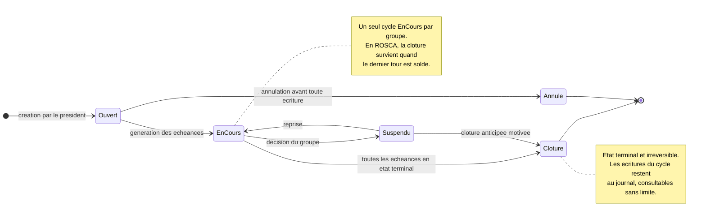
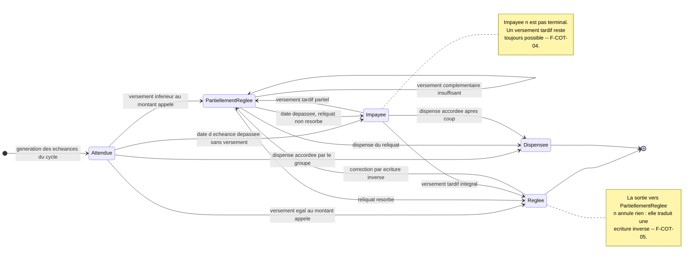
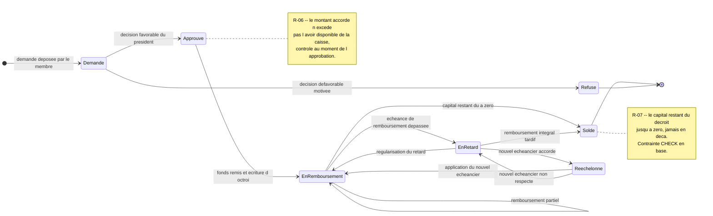
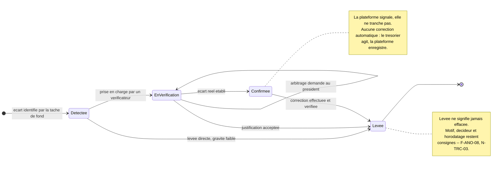

# Diagrammes d'états-transitions

Ce document décrit le cycle de vie des quatre entités qui en possèdent un : le cycle, l'échéance, le
prêt et l'anomalie. Chaque diagramme est suivi du tableau de ses transitions, avec l'événement
déclencheur et la règle qui l'autorise.

**Ce que ces diagrammes ne montrent pas** : ni la structure des données
(voir [`classes.md`](classes.md)), ni la chronologie technique des appels
(voir [`sequences.md`](sequences.md)). Ils ne décrivent pas non plus le cycle de vie de l'écriture
comptable — et c'est délibéré : une écriture n'a pas d'états. Elle est créée, puis immuable
(R-02, F-TRX-02). Une machine à états sur `Ecriture` supposerait qu'on puisse la modifier après
coup, ce que le modèle interdit.

Référence transverse : [cahier des charges](../cahier-des-charges.md).

---

## 1. Cycle

Le cycle est la période au terme de laquelle, en ROSCA, tous les membres ont bénéficié d'un tour. Il
structure la génération des échéances et sert de cadre à la redistribution en ASCA.

### Transitions

| État source | Événement | État cible | Règle / condition |
|---|---|---|---|
| *(initial)* | Création par le président | `Ouvert` | Le groupe ne doit avoir aucun cycle déjà `EnCours` (F-GRP-05). |
| `Ouvert` | Génération des échéances | `EnCours` | Les échéances sont produites selon la périodicité et le montant en vigueur à la date d'appel (F-COT-01, R-09). En ROSCA, l'ordre de passage doit être défini au préalable (F-TOU-01). |
| `Ouvert` | Annulation | `Annulé` | Possible tant qu'aucune écriture n'est rattachée au cycle. Au-delà, l'annulation est impossible : le journal est immuable (R-02). |
| `EnCours` | Toutes les échéances en état terminal | `Clôturé` | Chaque échéance est `Réglée`, `Dispensée` ou explicitement soldée. En ROSCA, tous les tours sont soldés et chaque membre a bénéficié une fois (R-04, F-TOU-05). |
| `EnCours` | Suspension décidée par le groupe | `Suspendu` | Décision tracée avec décideur et motif (N-TRC-03). Les échéances restent en l'état, aucune nouvelle n'est appelée. |
| `Suspendu` | Reprise | `EnCours` | Les échéances non appelées pendant la suspension sont décalées, jamais supprimées. |
| `Suspendu` | Clôture anticipée | `Clôturé` | Motif obligatoire. Les échéances impayées restent consignées comme telles : la clôture ne les efface pas. |
| `Clôturé` | — | *(terminal)* | Aucune transition sortante. Rouvrir un cycle clôturé permettrait de réécrire un exercice arrêté. |

---

## 2. Échéance

L'échéance est le montant attendu d'un membre à une date donnée. C'est l'unité de suivi du
recouvrement, et l'entité dont le cycle de vie est le plus sollicité.

### Transitions

| État source | Événement | État cible | Règle / condition |
|---|---|---|---|
| *(initial)* | Génération des échéances du cycle | `Attendue` | Le montant appelé est figé à la génération, au montant en vigueur à cette date (R-09, F-COT-01). |
| `Attendue` | Versement inférieur au montant appelé | `PartiellementRéglée` | Le reliquat est calculé et affiché. L'écriture est enregistrée pour le montant réellement reçu (F-COT-03). |
| `Attendue` | Versement égal au montant appelé | `Réglée` | Le reliquat est nul. Une écriture équilibrée est créée (F-COT-02, R-01). |
| `Attendue` | Date d'échéance dépassée sans versement | `Impayée` | Transition automatique, évaluée par la tâche de fond. Génère une anomalie `COTISATION_MANQUANTE` (F-ANO-01, F-COT-04). |
| `Attendue` | Dispense accordée par le groupe | `Dispensée` | Décision du président, motif obligatoire, décideur tracé (F-COT-07, N-TRC-03). |
| `PartiellementRéglée` | Versement complémentaire insuffisant | `PartiellementRéglée` | Boucle sur elle-même : chaque versement produit sa propre écriture, le reliquat décroît. |
| `PartiellementRéglée` | Reliquat résorbé | `Réglée` | La somme des cotisations imputées égale le montant appelé. |
| `PartiellementRéglée` | Date dépassée, reliquat non résorbé | `Impayée` | L'échéance est signalée comme impayée pour son reliquat, non pour la totalité (F-COT-04). |
| `PartiellementRéglée` | Dispense du reliquat | `Dispensée` | Le groupe exonère le membre du reste dû. Les versements déjà effectués restent acquis. |
| `Impayée` | Versement tardif partiel | `PartiellementRéglée` | Aucune pénalité automatique : la plateforme applique les règles du groupe, elle ne les édicte pas. |
| `Impayée` | Versement tardif intégral | `Réglée` | Peut déclencher une anomalie `SAISIE_ANTIDATEE` si la date de versement déclarée est nettement antérieure à la saisie (F-ANO-06). |
| `Impayée` | Dispense accordée après coup | `Dispensée` | Régularisation a posteriori, motif obligatoire. |
| `Réglée` | Correction par écriture inverse | `PartiellementRéglée` | L'écriture d'origine n'est ni modifiée ni supprimée : une écriture inverse portant `ecriture_corrigee_id` réduit le montant encaissé (F-COT-05, N-TRC-02, R-02). |

---

## 3. Prêt

Le prêt est une créance de la caisse ASCA sur un membre. Son cycle de vie couvre la décision, le
remboursement et les difficultés — retard et rééchelonnement.

### Transitions

| État source | Événement | État cible | Règle / condition |
|---|---|---|---|
| *(initial)* | Demande déposée par le membre | `Demandé` | Le groupe doit être de type ASCA. Le demandeur est un membre actif (F-PRE-01). |
| `Demandé` | Décision favorable du président | `Approuvé` | Le montant n'excède pas l'avoir disponible de la caisse, recalculé depuis le journal (R-06). Décideur et date tracés (F-PRE-02, N-TRC-03). |
| `Demandé` | Décision défavorable | `Refusé` | Motif obligatoire. État terminal : une nouvelle demande donne lieu à un nouveau prêt, jamais à la réouverture de celui-ci (F-PRE-02). |
| `Approuvé` | Remise des fonds et écriture d'octroi | `EnRemboursement` | Écriture équilibrée — débit créance de prêt, crédit caisse. L'échéancier est produit à cet instant (F-PRE-03). Le capital restant dû est initialisé au montant accordé. |
| `EnRemboursement` | Remboursement partiel | `EnRemboursement` | Chaque remboursement produit son écriture et décrémente le capital restant dû (F-PRE-04). Les intérêts suivent la règle du groupe (F-PRE-05). |
| `EnRemboursement` | Échéance de remboursement dépassée | `EnRetard` | Transition automatique détectée en tâche de fond. Crée une anomalie `REMBOURSEMENT_RETARD` (F-ANO-02, F-PRE-06). |
| `EnRemboursement` | Capital restant dû ramené à zéro | `Soldé` | Le capital ne peut jamais devenir négatif — contrainte `CHECK` (R-07). Un versement excédentaire est refusé ou imputé aux intérêts. |
| `EnRetard` | Régularisation du retard | `EnRemboursement` | L'anomalie associée est proposée à la levée, écart résorbé (F-ANO-08). |
| `EnRetard` | Nouvel échéancier accordé | `Rééchelonné` | Décision du président, motif obligatoire (F-PRE-07, N-TRC-03). Le capital restant dû est inchangé : rééchelonner n'efface pas la dette. |
| `EnRetard` | Remboursement intégral tardif | `Soldé` | L'historique du retard reste consigné : le passage à `Soldé` ne l'efface pas. |
| `Rééchelonné` | Application du nouvel échéancier | `EnRemboursement` | Le nouvel échéancier remplace l'ancien, qui reste consultable dans l'historique. |
| `Rééchelonné` | Nouvel échéancier non respecté | `EnRetard` | Un second rééchelonnement reste possible, mais la gravité de l'anomalie est relevée. |

---

## 4. Anomalie

L'anomalie est un signalement produit automatiquement, jamais une accusation. Son cycle de vie est
celui d'une vérification humaine : détectée par le système, vérifiée puis tranchée par une personne.

### Transitions

| État source | Événement | État cible | Règle / condition |
|---|---|---|---|
| *(initial)* | Écart identifié par la tâche de fond | `Détectée` | Détection asynchrone, sans blocage de la saisie (N-PRF-03). Une anomalie ouverte de même type et même périmètre est mise à jour, pas recréée. La gravité est attribuée à la création (F-ANO-07). |
| `Détectée` | Notification émise | `Détectée` | Trésorier et commissaire notifiés selon la gravité ; le commissaire est toujours informé des anomalies graves (F-NOT-03, F-ANO-09, F-NOT-06). |
| `Détectée` | Prise en charge par un vérificateur | `EnVérification` | L'identité du vérificateur est consignée. Un cumul trésorier / commissaire est signalé comme autocontrôle (F-MBR-06). |
| `Détectée` | Levée directe | `Levée` | Réservée aux gravités faible et moyenne. Une anomalie grave passe obligatoirement par la vérification (F-ANO-09). Motif obligatoire. |
| `EnVérification` | Écart réel établi | `Confirmée` | Constat décrit et tracé. Aucune correction n'est appliquée automatiquement : la plateforme n'est pas une autorité d'arbitrage. |
| `EnVérification` | Justification acceptée | `Levée` | Motif obligatoire et non vide (F-ANO-08, N-TRC-03). Le trésorier est notifié de la levée et de son motif. |
| `EnVérification` | Désaccord, arbitrage demandé | `EnVérification` | L'anomalie reste ouverte, le président est notifié. La trace du désaccord est conservée : la décision reste humaine. |
| `Confirmée` | Correction effectuée et vérifiée | `Levée` | La correction passe par une écriture inverse ou une saisie manquante (F-COT-05). La levée référence l'écriture corrective. |
| `Levée` | — | *(terminal)* | État terminal non réinscriptible. L'anomalie sort du tableau de bord (F-TDB-04) mais demeure au dossier : la levée fait partie de la piste d'audit. Un nouvel écart crée une nouvelle anomalie. |

---

## Points de vigilance

- **`Impayée` n'est pas un état terminal.** C'est l'erreur de conception la plus tentante : marquer
  une échéance impayée comme définitivement close simplifierait les requêtes, mais interdirait le
  versement tardif, qui est le cas courant dans les groupes réels. Une échéance ne sort de sa vie
  active que par `Réglée` ou `Dispensée`.
- **`Réglée` admet une transition sortante, et c'est volontaire.** Une correction par écriture
  inverse (F-COT-05) ramène l'échéance à `PartiellementRéglée`. Traiter `Réglée` comme terminal
  rendrait toute correction impossible, ou pire, conduirait à modifier l'écriture d'origine — ce que
  R-02 interdit absolument.
- **Aucun état ne se déduit d'une colonne stockée seule.** L'état d'une échéance résulte de la
  comparaison entre le montant appelé et la somme des cotisations imputées, elle-même issue du
  journal. Stocker l'état est un cache légitime, mais il doit être recalculable et vérifié par
  F-ANO-04 — un état figé qui diverge du journal est une incohérence silencieuse.
- **Le cycle ROSCA ne se clôture pas manuellement.** Sa clôture est la conséquence du dernier tour
  soldé. Exposer un bouton « clôturer le cycle » permettrait de l'arrêter alors que des membres
  n'ont pas encore bénéficié, en violation du §3.1.
- **`Rééchelonné` n'efface jamais la dette.** Le capital restant dû est strictement inchangé par la
  transition : seul l'échéancier change. Une implémentation qui remettrait le compteur à zéro
  transformerait un aménagement en remise de dette, décision qui n'appartient pas au système.
- **Une anomalie levée ne peut pas être rouverte.** Si l'écart réapparaît, une nouvelle anomalie est
  créée. Rouvrir modifierait un enregistrement d'audit clos et rendrait ambiguë la lecture de
  l'historique : deux vérifications distinctes méritent deux traces distinctes.
- **Les transitions automatiques doivent rester idempotentes.** `Attendue` vers `Impayée` et
  `EnRemboursement` vers `EnRetard` sont évaluées à chaque passage de la tâche de fond. Elles ne
  doivent produire ni notification répétée, ni anomalie dupliquée.
