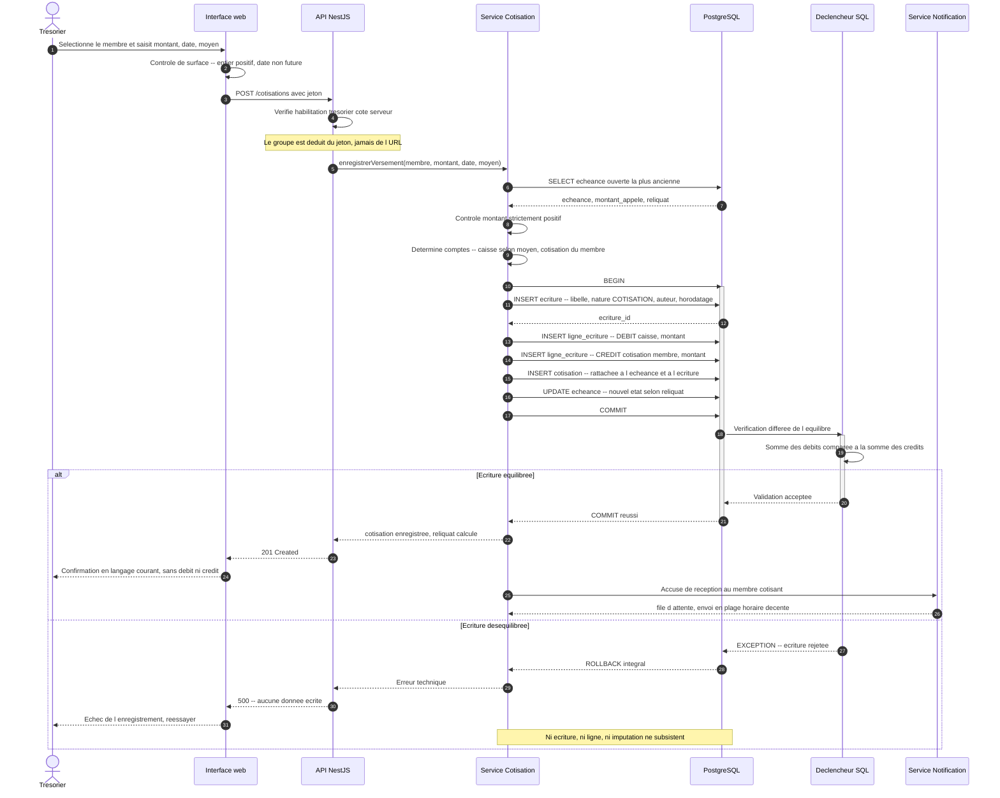
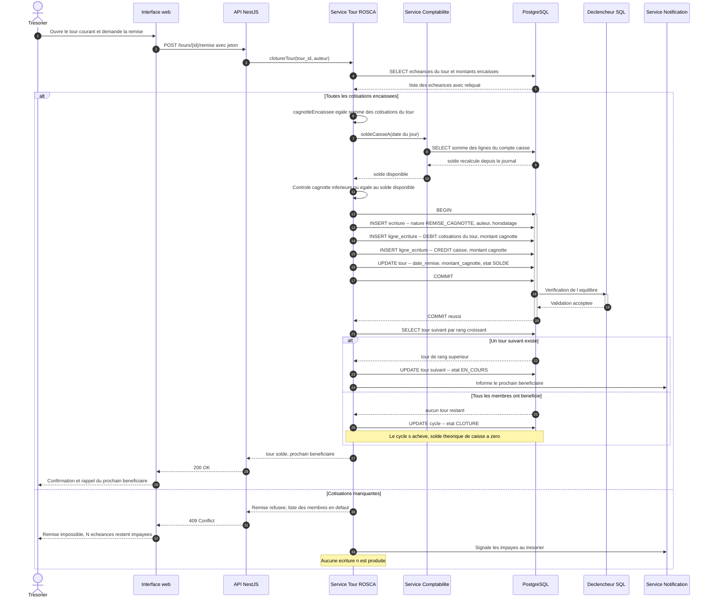
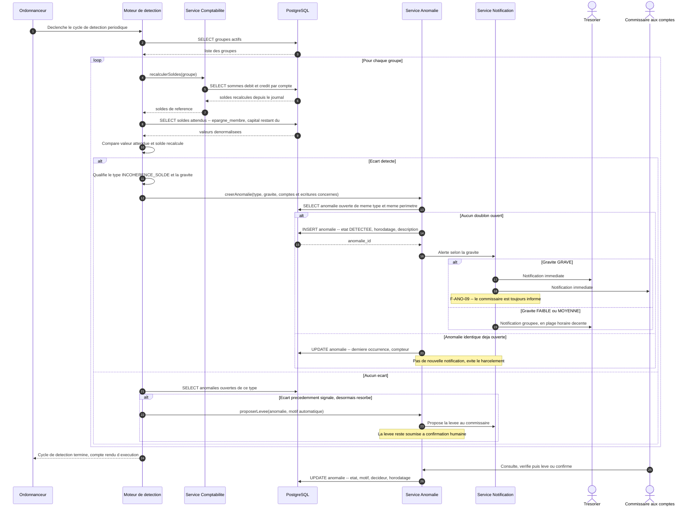

# Diagrammes de séquence

Ce document décrit la chronologie de trois opérations représentatives : l'enregistrement d'une
cotisation, la clôture d'un tour ROSCA, et la détection automatique d'une anomalie. Chacune traverse
les mêmes couches — interface, API, service métier, base — et chacune aboutit, lorsqu'elle déplace
de l'argent, à une écriture équilibrée au journal.

**Ce que ces diagrammes ne montrent pas** : ni la structure des données
(voir [`classes.md`](classes.md)), ni les états intermédiaires exhaustifs
(voir [`etats.md`](etats.md)), ni les détails d'authentification. Le groupe est systématiquement
déduit du jeton porté par l'appel, jamais d'un paramètre d'URL (N-SEC-03) ; ce contrôle est implicite
dans tous les diagrammes ci-dessous.

Référence transverse : [cahier des charges](../cahier-des-charges.md) et
[décision 0003](../decisions/0003-journal-partie-double.md).

---

## 1. Enregistrer une cotisation

Le trésorier a reçu un versement hors application — en espèces ou par Mobile Money. Il vient
l'inscrire au registre. L'opération doit tenir en moins de 30 secondes (N-USG-04) et produire une
écriture équilibrée dont la base, et non l'application, garantit l'équilibre (N-INT-02).

Le point central du diagramme est l'étape de validation : l'insertion des lignes précède la
vérification, qui s'exécute à la validation de la transaction. Un déséquilibre n'est pas corrigé,
il est rejeté, et la transaction entière est annulée.

### Points d'attention

- **Le rejet est total, jamais partiel.** L'ensemble — écriture, lignes, cotisation, mise à jour de
  l'échéance — vit dans une seule transaction (N-INT-04). Une écriture sans ses lignes, ou une
  cotisation sans son écriture, serait un état incohérent dont le journal ne se relèverait pas.
- **Le déclencheur s'exécute à la validation, pas à chaque insertion.** Une contrainte évaluée ligne
  à ligne rejetterait la première ligne d'une écriture forcément déséquilibrée à cet instant.
  L'équilibre n'a de sens que sur l'écriture complète : la vérification est donc différée au `COMMIT`.
- **Un déséquilibre est un défaut du service, jamais une erreur de l'utilisateur.** Le trésorier
  saisit un montant, pas des débits et des crédits. Le message d'erreur ne doit jamais l'exposer à
  un vocabulaire comptable (N-USG-05).
- **La notification sort de la transaction.** L'accusé de réception (F-NOT-02) est mis en file après
  validation. Envoyer dans la transaction lierait la durabilité de l'écriture à la disponibilité
  d'un service externe, et respecter la plage horaire décente (F-NOT-06) exige de différer.
- **La détection d'anomalies n'intervient pas ici.** Elle est asynchrone (N-PRF-03). Une double
  saisie probable (F-ANO-05) sera signalée plus tard, sans jamais bloquer la saisie.

---

## 2. Clôturer un tour ROSCA et remettre la cagnotte

À chaque tour, un seul membre reçoit la totalité de la cagnotte. La caisse est vidée : son solde
théorique retombe à zéro. La séquence enchaîne une vérification d'encaissement, un calcul de
cagnotte, une écriture de remise et le passage au tour suivant.

L'ordre compte : on ne remet jamais une cagnotte avant d'avoir vérifié que toutes les cotisations du
tour sont effectivement encaissées. Remettre sur la foi des montants attendus reviendrait à
distribuer de l'argent qui n'est pas dans la caisse.

### Points d'attention

- **La cagnotte remise est la somme réellement encaissée, pas la somme attendue.** R-05 impose
  l'égalité entre les cotisations du tour et le montant remis. Calculer la cagnotte depuis les
  montants appelés créerait mécaniquement un déséquilibre dès la première cotisation partielle.
- **Le sens des écritures surprend au premier abord.** La remise débite les comptes de cotisations
  et crédite la caisse : l'argent sort de la caisse, les dettes du groupe envers les cotisants sont
  soldées. C'est l'inverse exact de l'écriture de cotisation, et c'est pourquoi le solde de caisse
  retombe à zéro à chaque tour, conformément au §3.1 du cahier des charges.
- **Le contrôle de solde disponible est une double sécurité.** Si toutes les cotisations sont
  encaissées, le solde suffit nécessairement. Le vérifier malgré tout détecte un écart comptable
  antérieur avant de distribuer de l'argent — c'est la même identité que celle qu'exploite F-ANO-04.
- **Un membre ne bénéficie qu'une fois par cycle.** R-04 est un index unique sur
  `(cycle_id, beneficiaire_id)` : la base refuse un second tour pour le même membre, quoi que fasse
  le service. F-TOU-05 est ainsi garanti par le schéma et non par une vérification applicative.
- **La clôture du cycle est une conséquence, pas une action.** Elle survient lorsque le dernier tour
  est soldé. Aucun acteur ne « clôture le cycle ROSCA » manuellement : le cycle s'achève quand tous
  les membres ont bénéficié.
- **Une permutation de bénéficiaires ne se fait jamais sur un tour soldé.** F-TOU-04 ne s'applique
  qu'aux tours à venir : permuter après remise réécrirait le passé.

---

## 3. Détecter et notifier une anomalie

La détection s'exécute en tâche de fond, sans jamais bloquer une saisie (N-PRF-03). Son principe est
une comparaison : le solde stocké ou attendu d'un côté, le solde recalculé depuis le journal de
l'autre. La partie double donne à cette comparaison son sens — sans vérité comptable de référence,
détecter une incohérence reviendrait à comparer une somme à elle-même.

Le scénario ci-dessous illustre F-ANO-04, l'incohérence de solde, qui est la plus structurante. Les
autres règles de détection suivent la même forme.

### Points d'attention

- **La détection ne corrige jamais.** Elle signale. Une correction automatique produirait une
  écriture que personne n'a décidée, et la plateforme n'est pas une autorité d'arbitrage : la
  décision reste humaine.
- **La déduplication est indispensable.** Sans elle, un écart persistant génère une anomalie à chaque
  passage de l'ordonnanceur et noie le signal. Une anomalie ouverte de même type et de même périmètre
  est mise à jour, pas recréée, et ne déclenche pas de nouvelle notification.
- **La levée automatique est proposée, jamais appliquée.** Un écart résorbé n'est pas un écart
  expliqué. F-ANO-08 confie la justification à une personne : le système peut rédiger le motif, il ne
  peut pas l'endosser.
- **Le vocabulaire des notifications est contraint.** « À vérifier », jamais « fraude ». Une anomalie
  est une incohérence détectée, et la plupart s'expliquent par un décalage de saisie.
- **La gravité pilote le circuit, pas seulement l'affichage.** F-ANO-09 réserve la notification
  immédiate du commissaire aux anomalies graves. Notifier tout le monde de tout revient à ne notifier
  personne de rien.
- **Comparer un solde dénormalisé à son recalcul suppose que le dénormalisé existe.** Là où aucune
  valeur n'est stockée — la caisse, le fonds d'aide — F-ANO-04 se vérifie autrement : par les
  identités propres au mécanisme, solde de caisse nul après remise en ROSCA, avoir égal à la somme
  des épargnes en ASCA, fonds égal aux cotisations moins les aides en mutuelle.
- **Le moteur lit beaucoup et écrit peu.** N-PRF-02 impose un solde calculé en moins de 100 ms sur
  10 000 écritures : les index sur `ligne_ecriture(compte_id, ...)` conditionnent la faisabilité
  d'une détection périodique sur l'ensemble des groupes.
